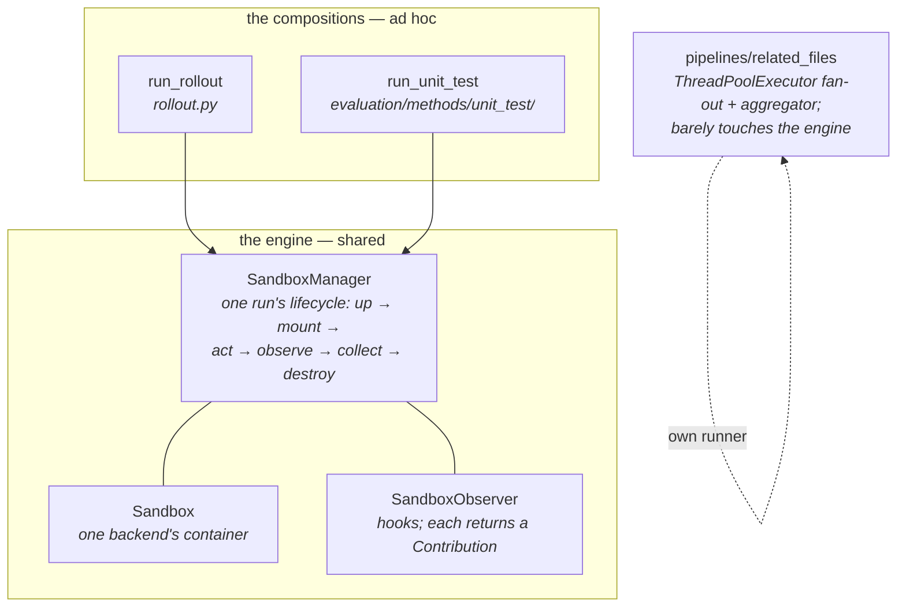
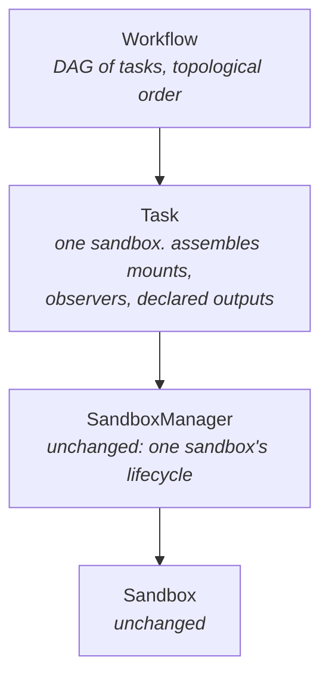
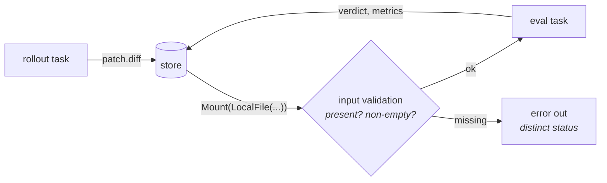

# ADR-0007: A task layer above the sandbox manager, and workflows over it

## Status

Proposed

## Date

2026-08-02

## Context

### Where we are

Three run-shaped things exist today, and they share one engine but no vocabulary
above it.

`run_rollout` and `run_unit_test` are the **same five steps**:

1. assemble mounts, 2. build a `SandboxManager` with observers, 3. inside
`session()`, perform the run's main action, 4. observers post-process in
`before_destroy` and hand back a `Contribution`, 5. return a typed outcome plus
`RunResult`.

The only difference is step 3: `harness.run(sb, …)` versus
`sb.run_script(entryscript)` with a retry loop.

### What is missing

- **The shape has no name.** A third composition means writing those five steps
  a third time. `pipelines/related_files` already did — it is a hand-rolled
  fan-out + join over N annotation agents, i.e. a workflow, hardcoded.
- **Edges between runs are hand-wired.** Rollout produces a patch, eval consumes
  it; today the CLI carries the value across. Nothing declares that dependency,
  so nothing validates it.
- **Task-level policy sits inside dataset data.** `UnitTestSpec` carries
  `eval_script` + `mounts` + `native_outputs` (what to run, generic), `grader`
  (how to judge, dataset-specific), and `retries` (policy, neither). The spec is
  growing into a bag, and will keep growing.
- **Runtime metrics have nowhere to go.** OOM kills, peak memory, setup time,
  CPU — all backend-specific, all only readable while the sandbox is live, and
  no seam declares them.

### What we are building toward

A **workflow**: tasks with declared dependencies, run in topological order, each
producing outputs the next can consume. Tasks include agent rollouts, unit-test
evaluation, model-as-judge grading, and annotation runs — today three of those
are three unrelated code paths.

## Decision

### 1. `Task` is one layer above `SandboxManager`, and owns exactly one sandbox

The manager keeps owning a single sandbox's lifecycle and nothing else. `Task`
sits above it and unifies the three things that are assembled per run: **the
mounts**, **the observers**, and **the declared outputs**.

**One task = one sandbox**, always. Rollout and eval isolate cleanly, which is
the common case and the one we implement first.

Several things that *should* share a sandbox are several **steps of one task** —
initially hand-written into that task's script, later a `steps` list if it earns
it. Deliberately **not** a second kind of task: `session` already means
`manager.session()`, one sandbox, and a `SessionTask` alongside a `SandboxTask`
would make the word mean two things.

### 2. A task's lifecycle is: mount → run → outputs

There is no separate "initialize" phase. The bound `TaskInstance` supplies two
things, and only one of them is a phase:

- the **run context** — `sandbox_spec()` (image, workdir, base commit), which is
  what the sandbox is built from;
- **mounts** — the dataset's own material, contributed exactly like every other
  contributor's.

So `TaskInstance` gains a `mounts()` interface and becomes the third mount
source, deciding for itself whether it stages anything at all. This is less a
new mechanism than finishing an existing pattern: `SandboxObserver.mounts()` and
`Harness.mounts(workdir)` already exist, and `merge_mounts` already refuses
duplicate targets.

| mount source | contributes | today |
|---|---|---|
| **the instance** | the dataset's material | `UnitTestSpec.mounts` — the run script, the parser, the compiled expectation |
| **the runner** | its own files and assets | `Harness.mounts(workdir)` — launcher script, pinned binary |
| **upstream tasks** | their persisted outputs | hand-wired by the CLI today |
| **observers** | whatever they need staged | `SandboxObserver.mounts()` |

Recognizing this is also what lets `UnitTestSpec` shrink: its `mounts` field
*is* the instance's mounts, already.

Registering a task should require thinking about nothing beyond mounts, a
script, and outputs.

### 3. Observers come from three places, and the distinction is load-bearing

Each source owns what only it can know:

| source | contributes | examples |
|---|---|---|
| **the sandbox** | backend runtime metrics | OOM kill, peak memory, setup time, CPU |
| **the runner** | how *it* is observed | agent trace → `Conversation`, completion signal |
| **the task** | its **declared outputs** | the patch, the verdict, an annotation JSON |

Each exposes an observer factory; the task composes them, sandbox first (its
observers measure the whole run). Metrics are namespaced through the existing
`qualified_name`, so `sandbox.peak_memory_bytes` cannot collide with `eval.*`.

Splitting runner from task matters concretely: `DiffExtractObserver` is **not**
the harness's — it is the declaration "this task produces a patch". Folding it
into the harness would make it impossible to run the same Claude Code harness in
a task that produces an annotation instead of a diff, which is exactly what
`pipelines/related_files` does.

### 4. The grader stays with the dataset; it is the parse half of an output

Every observer in this codebase already produces an output, and `Contribution`
already distinguishes the two kinds — `artifacts` (raw, still in the sandbox)
versus `inline_artifacts` (already parsed, in hand).

| observer | raw byproduct | parsed output |
|---|---|---|
| `DiffExtractObserver` | the working tree | `patch.diff` |
| `ConversationObserver` | the agent's trace files | `conversation.json` |
| `EvalParseObserver` | `output.json` | a `Verdict` |
| sandbox metrics (new) | cgroup / inspect | scalar metrics |

So a **declared output is a name plus a producer**, and `grader` is one
producer. It stays where it is — supplied by the dataset, which is the only
thing that knows its own output format — and simply stops being a special-cased
field.

This is why there is **no `Evaluator` class**. `Harness` is a class because it
has an action of its own (launch an agent CLI); evaluation's action is "run the
script", which is the task's default action. An `Evaluator` would be one class
per dataset carrying no information the dataset does not already provide.

### 5. Edges are outputs in the store, mounted and validated

No new mechanism: `Resource` already has `LocalFile`, and `Store` already has
`put` / `get` plus `RunRecord` manifests (ADR-0004).

A validation failure must be its **own status**, not an unresolved verdict — a
broken edge and a failed evaluation call for opposite responses, and
`RunStatus` / `RunResult.error` already carry that distinction. An empty patch
(`is_empty`) is caught here too, rather than spending a container on it.

### 6. Retry becomes task-level policy with a predicate over outputs

`UnitTestSpec.retries` moves onto the task. Retry needs a notion of "done",
which generalizes to a predicate over the task's declared outputs; for
evaluation it reads the verdict's `resolved`. ADR-0005's cost argument is
unchanged — it just stops living inside dataset data.

### 7. Provided subclasses, open registry

A small set ships (a coding-agent task, a unit-test evaluation task); a
consumer defines its own by supplying mounts, a script, and outputs, the same
import-only extension the fix and sandbox registries already use.

## Alternatives considered

| Option | Why not |
|---|---|
| **An `Evaluator` class symmetric to `Harness`.** | It would be one class per dataset carrying nothing the dataset does not already produce. The asymmetry is real: a harness has an action; an evaluator does not. |
| **Move the grader out of the dataset into the runner.** | The grader parses that dataset's output format. Moving it forces a per-dataset runner — the same problem one level over. |
| **`SessionTask` alongside `SandboxTask`.** | `session` already means one sandbox lifecycle. Steps inside one task express the same thing without overloading the word. |
| **Let the workflow own one sandbox across tasks.** | Deferred, not rejected. It trades isolation for warm caches, and the isolation is what makes a graded eval trustworthy. Revisit when a real case needs it. |
| **Adopt an off-the-shelf workflow engine.** | The DAG here is small and the hard parts (sandbox lifecycle, artifact transfer, observation) are already ours. A dependency would own the easy half. |
| **Leave it: keep writing compositions by hand.** | Three exist and they already disagree; the fourth is an annotation pipeline that reinvented fan-out. |

## Consequences

**Good**

- One vocabulary for rollout, evaluation, annotation and judging.
- `SandboxManager` and both existing compositions are untouched, so this lands
  **additively** — downstream keeps its direct API while the task layer grows.
- Runtime metrics finally have a home, and it is the backend that owns them.
- `UnitTestSpec` stops growing: policy leaves, the grader becomes an ordinary
  declared output.

**Bad, and accepted knowingly**

- One sandbox per task costs a container per step; a rollout + eval pair pays
  two setups where the old CLI path paid two anyway.
- A DAG makes failure attribution harder: "which task failed and why" needs to
  survive into the record, or a workflow becomes a black box.

**Open, to be settled while implementing**

- The name of the general spec (`TaskSpec` / `RunSpec` / `StepSpec`).
- **Who names the prompt file.** `PROMPT_NAME = "prompt.txt"` lives in
  `harnesses/base.py` and is documented there as the composition↔harness
  contract: the dataset owns the prompt's *content*, the runner owns *where it
  lands*. If `TaskInstance.mounts()` staged it, every dataset would have to know
  every runner's filename convention. The likely split is that `mounts()`
  carries material whose layout is the instance's own business, while the prompt
  keeps flowing through `prompt()` and the task places it where the runner asks
  — but that is a seam to settle with a second runner in hand, not before.
- Whether `TaskInstance.unit_test_spec` survives as-is or becomes a general
  "compile a task for this instance".
- How a workflow is declared (Python object graph vs a serialized form) and
  where its run record lives relative to ADR-0004's layout.
- Whether `pipelines/related_files` is migrated onto tasks or left alone; it is
  the acid test for whether the abstraction is sufficient, and if it cannot be
  expressed, this ADR is wrong.

This ADR is expected to be **amended or partly superseded** as it is
implemented; the settled architecture is reconciled into
[`docs/horizontal/spec.md`](../horizontal/spec.md), which stays the
project-level view.
