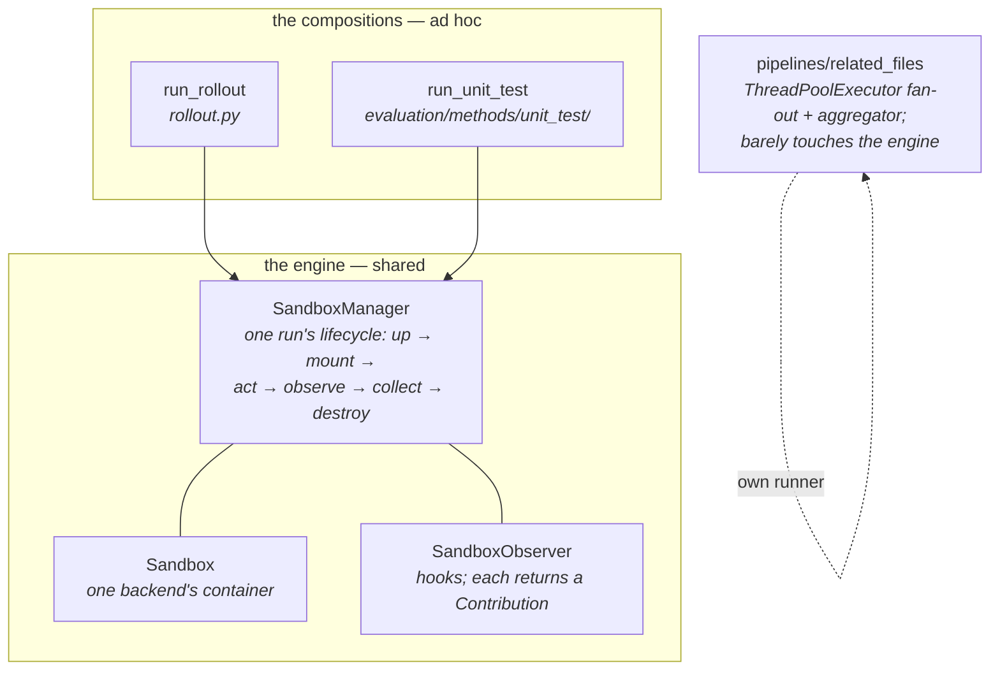
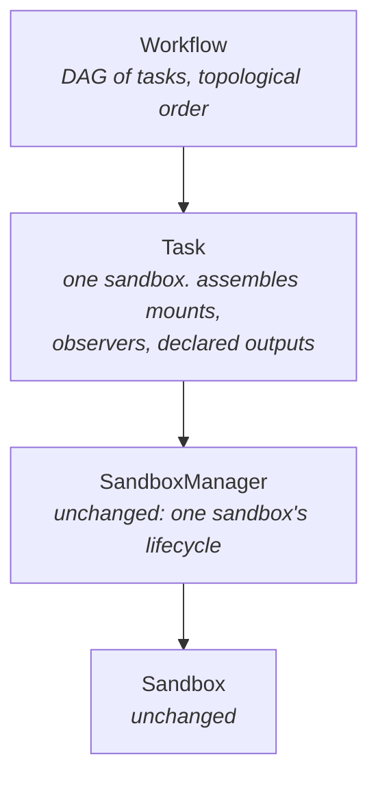
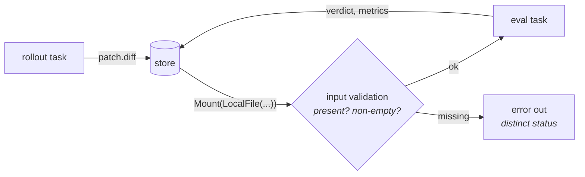
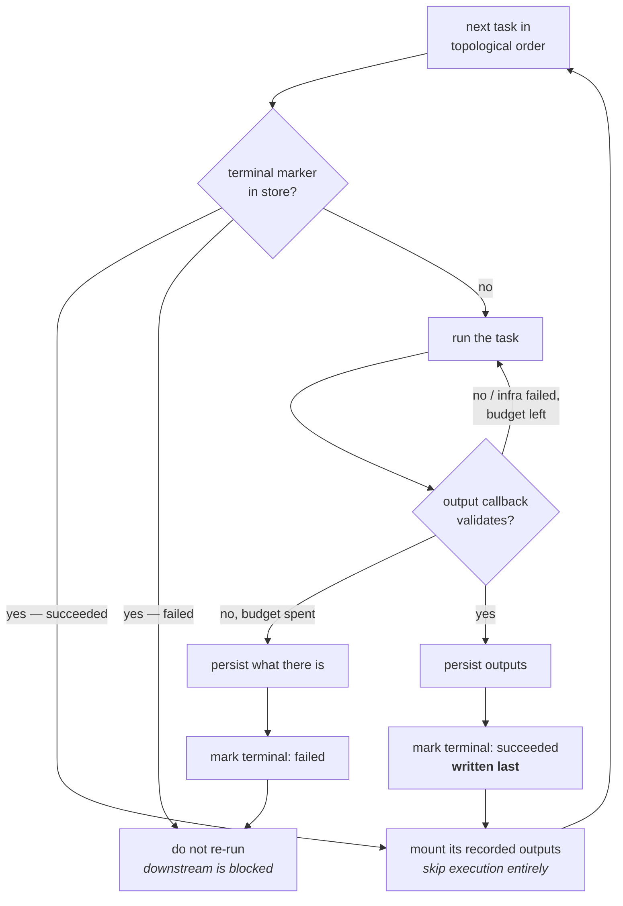

# ADR-0007: A task layer above the sandbox manager, and workflows over it

## Status

Accepted

## Date

2026-08-02

## Context

### Where we are

Three run-shaped things exist today, and they share one engine but no vocabulary
above it.

`run_rollout` and `run_unit_test` are the **same five steps**:

1. assemble mounts, 2. build a `SandboxManager` with observers, 3. inside
`session()`, perform the run's main action, 4. observers post-process in
`before_destroy` and hand back a `Contribution`, 5. return a typed outcome plus
`RunResult`.

The only difference is step 3: `harness.run(sb, …)` versus
`sb.run_script(entryscript)` with a retry loop.

### What is missing

- **The shape has no name.** A third composition means writing those five steps
  a third time. `pipelines/related_files` already did — it is a hand-rolled
  fan-out + join over N annotation agents, i.e. a workflow, hardcoded.
- **Edges between runs are hand-wired.** Rollout produces a patch, eval consumes
  it; today the CLI carries the value across. Nothing declares that dependency,
  so nothing validates it.
- **Task-level policy sits inside dataset data.** `UnitTestSpec` carries
  `eval_script` + `mounts` + `native_outputs` (what to run, generic), `grader`
  (how to judge, dataset-specific), and `retries` (policy, neither). The spec is
  growing into a bag, and will keep growing.
- **Runtime metrics have nowhere to go.** OOM kills, peak memory, setup time,
  CPU — all backend-specific, all only readable while the sandbox is live, and
  no seam declares them.

### What we are building toward

A **workflow**: tasks with declared dependencies, run in topological order, each
producing outputs the next can consume. Tasks include agent rollouts, unit-test
evaluation, model-as-judge grading, and annotation runs — today three of those
are three unrelated code paths.

## Decision

### 1. `Task` is one layer above `SandboxManager`, and owns exactly one sandbox

The manager keeps owning a single sandbox's lifecycle and nothing else. `Task`
sits above it and unifies the three things that are assembled per run: **the
mounts**, **the observers**, and **the declared outputs**.

**One task = one sandbox**, always. Rollout and eval isolate cleanly, which is
the common case and the one we implement first.

Several things that *should* share a sandbox are several **steps of one task** —
initially hand-written into that task's script, later a `steps` list if it earns
it. Deliberately **not** a second kind of task: `session` already means
`manager.session()`, one sandbox, and a `SessionTask` alongside a `SandboxTask`
would make the word mean two things.

### 2. A task's lifecycle is: mount → run → outputs

There is no separate "initialize" phase. The bound `TaskInstance` supplies two
things, and only one of them is a phase:

- the **run context** — `sandbox_spec()` (image, workdir, base commit), which is
  what the sandbox is built from;
- **mounts** — the dataset's own material, contributed exactly like every other
  contributor's.

So `TaskInstance` gains a `mounts()` interface and becomes the third mount
source, deciding for itself whether it stages anything at all. This is less a
new mechanism than finishing an existing pattern: `SandboxObserver.mounts()` and
`Harness.mounts(workdir)` already exist, and `merge_mounts` already refuses
duplicate targets.

| mount source | contributes | today |
|---|---|---|
| **the instance** | the dataset's material | `UnitTestSpec.mounts` — the run script, the parser, the compiled expectation |
| **the runner** | its own files and assets | `Harness.mounts(workdir)` — launcher script, pinned binary |
| **upstream tasks** | their persisted outputs | hand-wired by the CLI today |
| **observers** | whatever they need staged | `SandboxObserver.mounts()` |

Recognizing this is also what lets `UnitTestSpec` shrink: its `mounts` field
*is* the instance's mounts, already.

Registering a task should require thinking about nothing beyond mounts, a
script, and outputs.

### 3. Observers come from three places, and the distinction is load-bearing

Each source owns what only it can know:

| source | contributes | examples |
|---|---|---|
| **the backend** | its sandbox's runtime metrics | OOM kill, peak memory, setup time, CPU |
| **the runner** | how *it* is observed | agent trace → `Conversation`, completion signal |
| **the task** | its **declared outputs** | the patch, the verdict, an annotation JSON |

Each exposes an observer factory; the task composes them, backend first (its
observers measure the whole run). ("Backend", not "sandbox": every observer
*type* is a `SandboxObserver` — named for what it watches — so the sources are
named for who contributes them.) Metrics are namespaced through the existing
`qualified_name`, so `sandbox.peak_memory_bytes` cannot collide with `eval.*`.

Splitting runner from task matters concretely: `DiffExtractObserver` is **not**
the harness's — it is the declaration "this task produces a patch". Folding it
into the harness would make it impossible to run the same Claude Code harness in
a task that produces an annotation instead of a diff, which is exactly what
`pipelines/related_files` does.

### 4. The grader stays with the dataset; it is the parse half of an output

Every observer in this codebase already produces an output, and `Contribution`
already distinguishes the two kinds — `artifacts` (raw, still in the sandbox)
versus `inline_artifacts` (already parsed, in hand).

| observer | raw byproduct | parsed output |
|---|---|---|
| `DiffExtractObserver` | the working tree | `patch.diff` |
| `ConversationObserver` | the agent's trace files | `conversation.json` |
| `EvalParseObserver` | `output.json` | a `Verdict` |
| sandbox metrics (new) | cgroup / inspect | scalar metrics |

So **outputs are declared by the observers that produce them**: each observer
carries a small output schema (store name, required, description — data only,
no parse concept), and a task's output schema is the merge of its composed
observers', with a duplicate store name failing at assembly the way a
duplicate mount target already does. *(Amended 2026-08-03: an earlier revision
routed this through a separate "producer" declaration; it was two fields of
description strapped to an indirection, and the description belongs on the
thing described.)* The `grader` stays where it is — supplied by the dataset,
which is the only thing that knows its own output format, and handed straight
to its parse observer rather than special-cased in a spec field.

This is why there is **no `Evaluator` class**. `Harness` is a class because it
has an action of its own (launch an agent CLI); evaluation's action is "run the
script", which is the task's default action. An `Evaluator` would be one class
per dataset carrying no information the dataset does not already provide.

### 5. Edges are outputs in the store, mounted and validated

No new mechanism: `Resource` already has `LocalFile`, and `Store` already has
`put` / `get` plus `RunRecord` manifests (ADR-0004).

A validation failure must be its **own status**, not an unresolved verdict — a
broken edge and a failed evaluation call for opposite responses, and
`RunStatus` / `RunResult.error` already carry that distinction. An empty patch
(`is_empty`) is caught here too, rather than spending a container on it.

### 6. Three nested levels of "run it again", and they are not the same thing

Two already exist and a third is being added, so they are named here rather than
left to collide:

| level | scope | keyed by | answers |
|---|---|---|---|
| **in-run retry** (ADR-0005) | same sandbox, same session | `Verdict.attempts` | the harness is nondeterministic |
| **task retry** (new) | new sandbox, same workflow run | `RunRecord.attempt` | the task's output failed validation |
| **resume** (new) | a *different process*, after preemption | the terminal marker | this task already reached a terminal state; do not run it |

Task retry reuses `RunRecord.attempt`, which ADR-0004 already defines as "a
re-run after an infrastructure failure" — the same shape, so each attempt gets
its own record instead of a new axis. A task's retry budget absorbs **both**
kinds of bad attempt: an output that failed validation, and infrastructure that
fell over under it.

**ADR-0004's key gains a task component**, becoming
`(sweep_id, instance_id, rollout_id, task, attempt)` — a rollout runs several
tasks, and each task has its own attempts. Without it two tasks of one instance
in one rollout collide. This ADR amends ADR-0004 on that point.

`UnitTestSpec.retries` moves onto the task. Retry needs a notion of "done",
which generalizes to a **callback over the task's declared outputs**; for
evaluation it reads the verdict's `resolved`. The budget is a task
hyperparameter. A task retries until its output validates, and only then does
the workflow move on.

### 7. Resume is separate logic from retry, and the marker is written last

Large workflows get **preempted**. Every execution is therefore treated as
*possibly a resume*: before running a task, look it up in the store, and skip it
if it is already terminal.

**Complete means terminal, and success and failure are both terminal.** A task
whose retries are exhausted is marked complete-with-failure, not left pending —
so resume re-runs only what never finished, and a permanently failing task
cannot burn a full budget again on every resume. Retry is what decides success
or failure; resume only decides what still needs running.

Retry and resume are deliberately different mechanisms rather than one budget:
**resume decides whether to enter a task; retry decides whether to leave it.**
A task killed mid-run leaves no marker, so resume simply runs it again from
scratch — it is not a half-finished attempt to be continued.

That split also explains why preemption costs no retry budget, without needing
to detect preemption at all: **retries are counted by the surviving
orchestrator, and preemption kills the orchestrator**, so nothing gets recorded
and the task is simply unmarked. Distinguishing "the sandbox fell over" from
"the whole job died" reduces to which process is still alive to write.

Three properties this ordering buys, each of them a failure we would otherwise
ship:

- **The marker is written after the outputs are durable.** Reversed, a crash in
  between would leave a task marked complete with nothing to show for it, and
  resume would skip it forever. Torn state without a marker is safe — it just
  re-runs.
- **The marker write must be atomic** (write-then-rename), or a preemption
  during the write leaves a partial marker that reads as complete.
- **Resumed outputs go through the same input validation as fresh ones.** A
  resumed artifact that is missing or corrupt is caught by the seam from
  section 5, not trusted because a marker existed.

Two consequences worth stating plainly:

- **A task must be safe to run from scratch at any time.** The eval entryscript
  already is — ADR-0005 made an attempt a clean repeat (`git reset --hard` +
  `git clean -fd`). Any new task owes the same.
- **The task boundary is the resume granularity.** One task is one sandbox, so
  preemption mid-task loses that whole sandbox; steps inside a task are not
  separately resumable. That gives "how big should a task be" a real answer:
  big enough to be worth its own container, small enough that losing one to
  preemption does not hurt.

### 8. The prompt is an argument to the runner, not a filename convention

`PROMPT_NAME = "prompt.txt"` in `harnesses/base.py` is a forced convention: the
composition stages the prompt under a fixed name and every harness has to agree
to read it there. It is retired.

**`prompt` becomes an argument to `Harness.run`, as a plain string.** Where it
lands — a file, an argv, stdin — is the harness's business, decided at run time.
Most harnesses will write it to a file, but taking a *filename* here would just
move the convention rather than remove it.

This needs no new mechanism: `SandboxFs.write` already exists, so a harness can
place the prompt itself during `run` rather than declaring it in `mounts`.

It also resolves the seam left open earlier — whether `TaskInstance.mounts()`
should stage the prompt. It should not: the dataset owns the prompt's *content*
and hands over a string; the runner owns everything about where it goes.

If a prompt ever needs to arrive as a file the caller already has, that is a
second argument (`prompt` / `prompt_file`, mutually exclusive) added then — not
a generality paid for now.

### 9. A workflow is a list before it is a DAG

The first version takes a **list of tasks in order**, and the caller owns the
topological sort. A DAG with declared dependencies comes later, once there is a
workflow that actually needs one.

Declaration is a **Python object graph** — the tasks are objects the caller
assembles. There is no separate serialized workflow format: the tasks can go in
a registry, which is what makes a serialized form cheap to add later if it is
wanted at all.

This also settles the "spec" question: there is **no separate `TaskSpec` type**.
A task *is* the thing the caller assembles — mounts, a script, outputs — so
introducing a spec object beside it would be a second name for one concept.

### 10. A workflow is all-or-nothing, and its record is derived

**Every task must succeed.** A terminally failed task blocks its dependents,
they are not attempted, and the workflow fails. There is nothing else to do with
a blocked dependent, and inventing a partial-success policy before anything
needs one buys complexity for a case we cannot yet describe.

The case that *would* justify one is a main task succeeding while an auxiliary
task fails — collecting the main output anyway. That is a real shape and it is
**deferred, not rejected**: it wants a task-level "optional" flag, and it should
arrive with the first workflow that actually has an auxiliary task.

**A workflow gets a run record, derived from its tasks'.** Nothing new is
measured; it is a roll-up of the per-task records that §6 already keys. Same
discipline as a task's marker, one level up: written **last**, after every task
record is durable, and **its absence means the workflow did not complete** — so
resume needs no separate workflow state.

That absence rule is safe precisely because task markers are terminal. A
workflow whose task failed has no record, so resume re-enters it — and
immediately hits that task's terminal marker, does not re-run it, blocks, and
fails again **having done no work**. Recording the failure at the workflow level
too would save a cheap re-entry, but it is a nicety, not a correctness
requirement; v1 can record success only.

### 11. Provided subclasses, open registry

A small set ships (a coding-agent task, a unit-test evaluation task); a
consumer defines its own by supplying mounts, a script, and outputs, the same
import-only extension the fix and sandbox registries already use.

## Alternatives considered

| Option | Why not |
|---|---|
| **An `Evaluator` class symmetric to `Harness`.** | It would be one class per dataset carrying nothing the dataset does not already produce. The asymmetry is real: a harness has an action; an evaluator does not. |
| **Move the grader out of the dataset into the runner.** | The grader parses that dataset's output format. Moving it forces a per-dataset runner — the same problem one level over. |
| **`SessionTask` alongside `SandboxTask`.** | `session` already means one sandbox lifecycle. Steps inside one task express the same thing without overloading the word. |
| **Let the workflow own one sandbox across tasks.** | Deferred, not rejected. It trades isolation for warm caches, and the isolation is what makes a graded eval trustworthy. Revisit when a real case needs it. |
| **Adopt an off-the-shelf workflow engine.** | The DAG here is small and the hard parts (sandbox lifecycle, artifact transfer, observation) are already ours. A dependency would own the easy half. |
| **One budget covering both retry and resume.** | They answer different questions — "is the work bad?" versus "did this process die?" — and merging them means a preempted task consumes retry budget it never spent on a real failure. |
| **Leaving a failed task pending, so resume retries it.** | It would re-run a full budget on every resume and can burn a sweep on one broken instance. Retry already exists to absorb an environmental failure; once it is spent, the outcome is an answer, not an absence. |
| **Resume from inside a task (step-level markers).** | A task is one sandbox; when it dies the sandbox is gone, so there is no state to resume into. Cutting tasks smaller is the honest way to get finer resume. |
| **A separate `TaskSpec` object beside `Task`.** | The task already *is* mounts + script + outputs. A spec next to it would be a second name for one concept, and the concept count is what we are trying to bring down. |
| **A DAG in the first version.** | The scheduler is the easy half and the least urgent; a list gets the task layer into use, and nothing about it forecloses a DAG. |
| **Partial success — let auxiliary tasks fail while the main one counts.** | A real shape, deferred not rejected. It needs a task-level "optional" flag, and it should arrive with the first workflow that actually has an auxiliary task rather than as speculative generality. |
| **Keeping `PROMPT_NAME` and staging the prompt from the instance.** | It makes every dataset know every runner's filename convention. Passing a string moves the decision to the only party that should hold it. |
| **Leave it: keep writing compositions by hand.** | Three exist and they already disagree; the fourth is an annotation pipeline that reinvented fan-out. |

## Consequences

**Good**

- One vocabulary for rollout, evaluation, annotation and judging.
- `SandboxManager` and both existing compositions are untouched, so this lands
  **additively** — downstream keeps its direct API while the task layer grows.
- Runtime metrics finally have a home, and it is the backend that owns them.
- `UnitTestSpec` stops growing: policy leaves, the grader becomes an ordinary
  declared output.

**Bad, and accepted knowingly**

- One sandbox per task costs a container per step; a rollout + eval pair pays
  two setups where the old CLI path paid two anyway.
- **`Harness.run` gains a `prompt` argument, which is breaking** for any
  downstream harness. `PROMPT_NAME` goes with it. The fix is mechanical, and it
  removes a convention every harness was forced to obey.
- A list-shaped workflow puts the topological sort on the caller. That is the
  point for now — it buys the task layer without the scheduler — but it means an
  ordering mistake is the caller's to notice until the DAG lands.
- A DAG makes failure attribution harder: "which task failed and why" needs to
  survive into the record, or a workflow becomes a black box.

**Open, to be settled while implementing**

- **Whether `TaskInstance.unit_test_spec` survives.** Kept as-is to start with —
  it is where evaluation is compiled today, and migrating it before the task
  layer exists would be guessing. Whether the field stays becomes clear as tasks
  absorb its parts (§2 already claims its `mounts`, §6 its `retries`), so this
  is a question the migration answers rather than one to answer up front.
- **Task identity is by key alone, deliberately.** Editing a task's script
  without changing its key would let resume reuse a stale completion. The fix is
  a fingerprint of (script, mounts, config) stored with the marker, and it is
  **deferred on purpose** — for now the discipline is manual: change the key
  when the task changes. Revisit when the manual discipline first fails, or when
  the cost of hashing large mounts is worth measuring.

`pipelines/related_files` is **not** migrated as part of this. It stays as it
is until the task layer is built. It remains the abstraction's real test — it is
a fan-out + join that mostly bypasses the engine, and if tasks cannot express it
this ADR is wrong — but that test is run *after* the environment is in place,
not as a condition for starting.
- **What a workflow does with a terminally failed task.** Its dependents cannot
  run, so they are blocked rather than attempted; whether the workflow then
  fails that instance outright or carries on with independent branches is a
  policy decision this ADR does not settle.
- **Task identity is by key alone, deliberately.** Editing a task's script
  without changing its key would let resume reuse a stale completion. The fix is
  a fingerprint of (script, mounts, config) stored with the marker, and it is
  **deferred on purpose** — for now the discipline is manual: change the key
  when the task changes. Revisit when the manual discipline first fails, or when
  the cost of hashing large mounts is worth measuring.

This ADR is expected to be **amended or partly superseded** as it is
implemented; the settled architecture is reconciled into
[`docs/horizontal/spec.md`](../horizontal/spec.md), which stays the
project-level view.

## Amendment (2026-08-03): two levels of "run it again", not three

§6's table listed **in-run retry** (ADR-0005) alongside task retry and resume.
It no longer exists: [ADR-0008](ADR-0008-retry-moves-to-the-task.md) retires
it, and its trigger survives as the eval task's `should_retry` hook. The table
now reads:

| level | scope | keyed by | answers |
|---|---|---|---|
| **task retry** | new sandbox, same workflow run | `AttemptRecord.attempt` | the task's output failed validation, or its own hook wants another try |
| **resume** | a *different process*, after preemption | the terminal marker | this task already reached a terminal state; do not run it |

§6's "`UnitTestSpec.retries` moves onto the task" landed one step further out:
the budget is **`WorkflowEntry.retries`** (or `run_task`'s argument), because a
task is a declaration and how many times to run it is invocation
configuration. `Verdict.attempts` / `flaky` are deleted with the loop.

## Amendment (2026-08-03): the instance binds at `execute`, not at construction

§2 described a task as bound to its instance. It is not: a task is
configuration only, the instance arrives at `execute(sandbox, instance, …)`,
and every hook receives it. That is what lets a workflow be a **statically
written definition**, registered by name and invoked against any instance —
the shape this ADR's §§5, 9–10 were reaching for.

Two consequences worth recording here, since §5 states the rules they change:

- **Edge resolution moves from construction to bind time.** An entry's output
  schema can be instance-derived, so the map is resolved at `execute`, before
  any container. Declaration keeps what it can decide alone: keys, binding
  syntax, and bindings against the static `input_schema()`.
- **Inputs have a third supplier.** Beside a workflow edge and the caller's own
  bytes, a task may carry an `inputs_builder` that generates its declared
  inputs *inside* the session (the prompt, a gold patch). An input nothing
  produces is therefore not automatically a dangling edge — it is the
  standalone shape, and requiredness is verified in-session, before the action.
