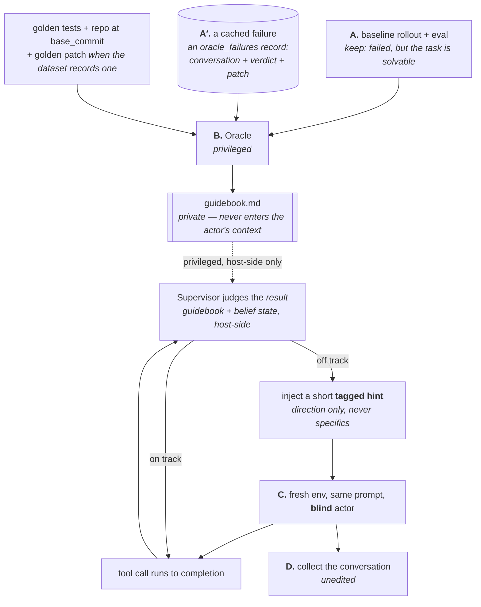

# Spec: Oracle-guided trace synthesis

> **Scope:** a new component, parallel to the [horizontal
> foundation](../horizontal/) rather than inside it — it consumes the engine,
> harness and workflow layers but adds a product line of its own (training-data
> synthesis) rather than shared plumbing. **Status lives only in
> [`plans/README.md`](plans/README.md)**, this component's task index.
>
> The mechanism decisions in [§5](#5-the-mechanism-decisions) were taken by the
> owner on 2026-08-31 and 2026-09-01 and are the design of record; earlier
> framings (a `PreToolUse` deny-and-redirect gate, and a phase D that surgically
> removed the interventions) are superseded and do not appear here.

## Objective

Produce **SFT training traces** for a coding agent on tasks in the *hard but
not impossible* band — around `pass@10 ≈ 3/10` — in which **every assistant
token is supported by the context visible before it**.

That second clause is the whole point. A trace is only worth training on if the
reasoning in it could have been produced by a model that knew only what the
trace shows it knowing. A trace that reaches the right answer by a route the
model could not have derived is worse than no trace: it looks like a good
example, and what it teaches is confident guessing.

It is a **design target, reached by construction rather than by a checker.**
The construction argument is [§6](#6-the-trace-is-the-conversation-unedited),
and it is an argument, not a test: the earlier framing's per-trace inducibility
checker was dropped *because* of it ([§7](#7-what-that-simplifies)). What
[§12](#12-invariants-intended-enforced-where-marked) can pin is the mechanical
half — that no intervention the actor received goes missing from the trace —
and beyond that the check is a human reading a sample
([§15](#15-success-criteria)).

## 1. The problem

Two obvious ways to get traces on this difficulty band both fail, and they fail
differently:

- **Rejection sampling** — run rollouts, keep the ones that pass. At 3/10 you
  burn roughly three rollouts per kept trace, and the ones you keep are the
  *lucky* ones. They frequently stumble into the answer, so what the data
  teaches is stumbling.
- **Imitating a privileged expert** — let an agent see the golden patch and
  write the trace. The result contains reasoning no blind model could have
  produced: "the fix is in `foo/bar.py`", with no derivation. Training on it
  teaches the model to *assert* knowledge it does not have, which is the
  shortest known path to a confident hallucinator.

## 2. What this is

The third way is an old idea in a new medium: **privileged-expert distillation
with on-policy correction**.

- *Learning by Cheating* (Chen et al., 2019) — a privileged agent sees ground
  truth; a blind student imitates it.
- *DAgger* (Ross et al., 2011) — the student rolls out and the expert corrects
  at the states the **student** actually visits, which is what removes the
  distribution shift plain behaviour cloning suffers from.

What is new is the medium of the correction: it is delivered **inside the
conversation, visibly marked as an interjection from outside**
([§11](#11-open-questions)), and it must be honest — vague enough that the
model's own next reasoning is a real derivation rather than the execution of an
instruction.

## 3. The pipeline

Four phases. A and B are offline and privileged; C is the run that produces the
trace; D is collection. **A is skippable**: when the failure already exists —
a full eval sweep caches one for every instance it failed on — it enters as an
`oracle_failures` record ([task 11](plans/task-11-oracle-failures-dataset.md))
and the pipeline starts at B.

### Phase A — baseline rollout and eval

Existing machinery ([`rollout_and_unit_test`](../horizontal/plans/task-22-late-binding-workflows.md)).
It produces a conversation, a patch and a verdict. We keep the instances where
the verdict is **failed** while the task is **known solvable** (the gold
self-test resolves). That pair — a real failure on a real solvable task — is
the raw material.

Measuring the `pass@10 ≈ 3/10` band properly costs ten rollouts per instance.
"One failed rollout plus a passing gold self-test" is the cheap proxy, at the
price of a fuzzier band; which of the two we use is [an open
question](#11-open-questions).

**Phase A is skipped when the failure already exists.** A full eval sweep
caches exactly this pair for every instance it failed on, and re-running a
rollout to reproduce one is a rollout paid for twice. The
[`oracle_failures` dataset](plans/task-11-oracle-failures-dataset.md) captures
a cached failure as a dataset record — the underlying instance's identity plus
the failed conversation, the grader's verdict and the submitted patch — built
from the finished run's own output directory
(`python -m swe_lab.datasets.oracle_failures.build`). The record delegates the
instance's whole runnable surface to the dataset it came from and adds the
failure through the instance's own `mounts()`, so every phase after A runs
against it unchanged. A fresh phase-A rollout is needed only for an instance no
sweep has failed on yet.

**Phase A is not re-run by the pipeline** (owner's decision, 2026-09-01). A full
rollout + eval sweep happens anyway, and its traces are cached, so the pipeline
paying to reproduce a failure it already owns is waste. The pipeline's entry
point is therefore **Phase B**, over a hand-assembled dataset row that carries
the instance's fields *and* the failing run's typed conversation — a
self-contained directory mounted into the sandbox, not a pointer into a run
store. The layout, and the reasoning for each file in it, is
[REPORT §8 of the steered re-run](../../experiments/trace_synthesis/steered_rerun/REPORT.md#8-the-failure-sample-is-the-workflows-input-contract);
it is a contract, and the workflow that mounts it is built against it.

### Phase B — the Oracle

A fresh agent with **privileged access** to:

- the full conversation of the failed rollout — what went wrong, in detail,
- the golden test patch — and the golden patch **when the dataset records
  one**; a dataset without a reference patch is a supported input, and the
  Oracle is then briefed without it,
- the repository at `base_commit`.

In the shipped form this is `OracleAnalysisTask`
([task 04](plans/task-04-oracle-analysis-task.md)), registered as the
one-entry `oracle_analysis` workflow: the failure arrives as the
`oracle_failures` record's own mounts; the task adds the grading procedure —
compiled to apply the failed patch, so the verdict can be reproduced in
place — and, when the dataset records one, the golden patch; the git history
is left unpurged. Without a reference patch the brief says so and drops every
instruction that would read one — that branch is tested, not tolerated.

It produces one artifact: a **guidebook** — a staged, step-by-step document
telling a *future, blind* agent how to solve this task. One entry per stage:

| Field | Content |
|---|---|
| `goal` | what this stage establishes |
| `actions` | which files to open, which searches to run, which commands |
| `expected observations` | what you should see if you are on the right track |
| `justification` | **how you could have known to do this** — grounded only in the problem statement and earlier stages |
| `exit criteria` | what tells you the stage is done |
| `edits` / `tests` | for the stages that change code |

Two rules on the guidebook:

1. **It should never say it saw the answer.** It reads as a tutorial, not as a
   diff summary. This is a property of generated prose and **nothing mechanical
   can check it** — the check is a human reading a sample, so it stays a rule
   for the Oracle's prompt rather than an invariant.
2. **Every step carries a derivable justification.** This is not cosmetic. The
   Supervisor in phase C can only produce an honest nudge toward a step if a
   derivable reason for that step exists. A guidebook that says "open
   `foo/bar.py`" with no reachable *why* leaves the Supervisor nothing to say
   except the answer. The schema enforces that the field **exists** — a
   guidebook whose stage lacks it is rejected
   ([task 04](plans/task-04-oracle-analysis-task.md#the-guidebook-schema)),
   as bold labels inside `## Stage N` sections, with `edits` / `tests` left
   optional; whether the reason is genuinely derivable is again a reader's
   judgement, not a test.

The guidebook is **private**: it is intended never to enter the actor's context
or the training trace. Nothing enforces that yet — see
[§12](#12-invariants-intended-enforced-where-marked) for the test that must land
with the code.

### Phase C — the guided rollout

A fresh sandbox, the same prompt, an actor with **no** privileged information —
an ordinary rollout, as far as the actor is concerned.

The steering runs **after each tool call completes**. The tool executes
normally; the hook hands the call and its result to a host-side **Supervisor**
model together with the guidebook and the **belief state** — a running summary
of what an honest, blind agent would know from the observations so far. The
Supervisor then takes one of two branches:

- **On track** — do nothing; update the belief state.
- **Off track or looping** — inject a short **tagged hint**: the sort of thing
  a person watching over the agent's shoulder would say ("I don't think that's
  the right direction — have you considered how this interacts with X?"),
  giving **a direction and never a specific**, and wrapped in a marker that
  says it came from outside ([§11](#11-open-questions)).

The belief state lives **host-side, outside the sandbox**. If the actor could
read a file written with oracle knowledge, the construction collapses — which
is why that, too, is one of the
[invariants](#12-invariants-intended-enforced-where-marked) a test has to pin.

### Phase D — collection

The conversation of the phase-C run **is** the training trace. **Nothing is
removed and nothing is synthesized** — see
[§6](#6-the-trace-is-the-conversation-unedited); that is an
[invariant](#12-invariants-intended-enforced-where-marked) with a named test, not
just a statement of intent. D converts the harness's
`stream-json` into the typed
[`Conversation`](../horizontal/plans/task-06a-conversation-protocol.md) and
persists it with the run's records.

D is a pure conversion: the recommended channel survives it
([§11](#11-open-questions)), so there is nothing to materialize. What D does owe
the design is the **guard** — a hint the converter cannot represent must fail
the conversion rather than produce a hint-less trace
([task 03](plans/README.md)).

**A capture is not automatically the conversation.** Two measured ways a
collector can be wrong about which bytes are the trace, both from
[§10](#the-stdin-channel--measured-and-not-a-hook): a proxy capture of a TUI
session contains a **prompt-suggestion exchange** whose body is the whole
conversation plus a user message nobody sent, and reading the *last* proxy
record picks exactly that one; and where the two captures disagree about a
message's shape, the **wire** is what the model saw. Both are collector
obligations, not channel properties, and the first is
[an invariant](#12-invariants-intended-enforced-where-marked) rather than
advice.

## 4. Why judging after the fact, and not before

The steering point is *after* the tool result, not before the tool call, and
the three reasons are structural rather than convenient:

1. **Judging after the observation is a far easier problem than predicting
   before it.** A pre-execution gate must answer "will this action turn out to
   be bad?" blind. A post-hoc judge answers "did that actually move us
   forward?" with the evidence in hand — fewer false interventions, and the
   ones it makes are better grounded.
2. **No fabricated tool failures.** A denial writes a `tool_result` with
   `is_error: true` for a call that would have succeeded — a lie inside the
   trace, which something downstream then has to remove.
3. **A user turn is a natural conversational shape.** People really do
   interrupt an agent with "I think you're going the wrong way". The
   conversation stays well-formed with no repair at all.

## 5. The mechanism decisions

Owner-decided (2026-08-31 / 2026-09-01). These are the design of record.

> **Injection is no longer the default, and is no longer an open option.** The
> production default is an **uninterfered rollout** with the guidebook used
> **post-hoc as a grader / filter** — rejection sampling — decided by the
> hint-legitimacy debate (2026-09-01). Injection survived that decision only as
> an **experiment arm behind one pre-registered micro-test**, and that
> micro-test **failed 0 of 3**
> ([report](../../experiments/trace_synthesis/hint_legitimacy/REPORT.md),
> adjudicated by a third party against criteria registered before the runs). The
> arm is **terminated**, by its own registered kill condition rather than by a
> change of mind: no tag swap, no channel swap, no model swap, no additional
> replicate. **The rows below are retained as the design of record for what an
> injecting run must do *if* one is ever run again** — every one of them was
> measured and none was refuted — but nothing in this section authorizes a
> production run that injects.

| Decision | Rationale |
|---|---|
| **Steer from a Claude Code hook** — not the proxy, not our own agent loop | The proxy ([task 08](../horizontal/plans/task-08-proxy-capture.md)) is already complex and folding steering into it couples the two badly. Our own agent loop abandons the point of this infrastructure, which is to hug the harness we actually want traces of. |
| **Never rewrite the tool call** | Measured: a rewritten call is *not* reflected back in the assistant turn, so the actor finishes the turn believing it did something it did not do, and every later step reasons from a false premise ([§10](#10-what-is-measured-about-hooks)). |
| **Appending is *our* invariant, not the platform's** | `updatedToolOutput`'s own schema says it **replaces** the tool output ([§10](#10-what-is-measured-about-hooks)); there is no append mode. So "the tool's real bytes survive verbatim" holds only because our hook copies them into every rewrite it emits, every time. This is the *never rewrite* red line in the specific shape this field takes — implementing append on top of a replace-semantics field — and it is a property of our code that a test has to hold up, not a guarantee we are given. |
| **Never deny** | Let the call execute and take its result; see [§4](#4-why-judging-after-the-fact-and-not-before). |
| **Inject as an identifiable external hint** *(terminated arm; see the note above)* | The intervention has to be honest *conditioning* — text the actor visibly received from outside, not a fabricated observation and not something it produced itself. What makes it honest is that the actor can **tell it apart**: an explicit marker (`<oracle_hint>` …) saying so. The wire-level `role` field is **not** the criterion (owner, 2026-09-01) — a tagged segment appended to a tool result qualifies, and so would a real user turn. What a trace may contain is decided by (a)/(b) in [§6](#what-disqualifies-a-trace--the-two-criteria-of-record); [§11](#11-open-questions) states the three tests a *delivery channel* has to pass. |
| **Direction only, never specifics** | The leakage / teaching dial; see [§8](#8-what-hint-specificity-now-trades). |
| **Not a system-reminder** | Claude Code already uses that channel heavily, so ours would be indistinguishable from machine noise — both to the actor at run time and to anyone reading the trace. |

> **The attribution row — *steer from a hook, not the proxy* — stands, and a
> conditional verdict is waiting on an experiment.** A structured debate
> adjudicated 2026-09-01 ruled **A′ now** — deliver the correction on the stdin
> of the live `claude -p --input-format stream-json` process — **gated on a
> registered compliance test that has not been run**, with the proxy-resident
> alternative gated on a witness that has not been run either
> ([verdict](../../experiments/trace_synthesis/process_supervision/DEBATE-VERDICT.md)).
> Neither gate has been attempted, so **nothing in this table changes**: an
> attribution decision moves only by a new ADR, and writing one now would record
> an unfinished decision as finished. The row below on *not a system-reminder*
> is the one the verdict would reopen — see the note in
> [§6](#6-the-trace-is-the-conversation-unedited) on why the mid-turn
> `<system-reminder>` is a different object from a hook's `additionalContext`.

## 6. The trace is the conversation, unedited

**The training trace is the phase-C conversation itself, with nothing removed
and nothing added.** Not the conversation minus the hints; not a reconstruction
assembled offline. Each hint is already a visible part of the conversation the
actor had — a tagged segment of a tool result
([§11](#11-open-questions)) — so [Phase D](#phase-d--collection) is a pure
conversion.

The reason is a property of the training objective, not a convenience:

- SFT takes loss on **assistant tokens only**. A user turn is *conditioning*,
  never a target.
- So the model is never trained to **produce** a hint — only to **respond well**
  to one. There is no mechanism by which keeping the hint teaches the model to
  assert something it cannot know.

And the sharper half: **deleting the hint is what would create the leak.** Strip
the user turn and what remains is an assistant that pivots hard for no visible
reason — which is precisely the pathology in the
[Objective](#objective): a confident, unmotivated jump. Keeping the hint means
every assistant token is justified by its own visible context, by construction.

### What disqualifies a trace — the two criteria of record

Owner's ruling, 2026-09-01. These are the criteria for this whole product line,
and they replace every earlier test phrased in terms of what a turn *looks*
like:

- **(a)** we would take SFT loss on tokens **the actor did not generate**;
- **(b)** the **context shape does not occur at inference time**.

**The wire-level `role` field is not one of them**, and neither is "is this a
clean `user` turn". A message the actor genuinely received is conditioning, not
a target, so it cannot violate (a) whatever role the wire gives it; whether it
violates (b) is an empirical question about the production front end, not a
question about the field.

What *does* violate (a) is a **synthetic assistant turn**. The `--resume` repair
pair writes `"No response requested."` as an assistant message the model never
produced; training on that takes loss on fabricated tokens, and it is the single
artifact that disqualifies the stop-and-resume path
([FEASIBILITY-A](../../experiments/trace_synthesis/process_supervision/FEASIBILITY-A.md)).
Its sibling `"Continue from where you left off."` is a synthetic **user** turn
and is **not** a disqualifier under either criterion.

**Deleting a turn is still forbidden, and (a)/(b) is not the reason.** A
deletion adds no tokens and can even improve the shape, so anyone reaching for
the new criteria to authorize one is holding the wrong instrument: **(a)/(b)
governs what may be added to a trace; this section governs what may be removed
from it.** The ban on removal is §6 itself and the [Objective](#objective) — an
assistant turn whose cause has been deleted is exactly the unmotivated pivot
this design exists to avoid.

**This subsection exists because the superseded criterion has already come back
once.** The stdin-channel experiment re-derived "not a genuine `user` turn, so
it is dirty" and disqualified mid-turn delivery on it, then corrected itself in
[§14.1 of its own report](../../experiments/trace_synthesis/streamjson_input/REPORT.md)
— *"I re-imported it without noticing"*. A rejected criterion does not decay; it
survives wherever it is still written down, so the replacement is stated here,
in the section that owns what a trace may contain, rather than only in the
report that killed it.

## 7. What that simplifies

Keeping the hints removes most of the machinery an earlier framing needed:

| Was going to be needed | Status under this design |
|---|---|
| A trace-surgery pass removing the intervention turns | **Gone** — there is nothing to remove, and ([task 02](plans/README.md)) nothing to insert either: the hint arrives inside the tool result and converts as it stands |
| An inducibility invariant enforced by a checker | **Satisfied by construction** — nothing in the trace is unexplained |
| A blind judge used as a **leak detector** | **Not needed for that job** — it may still earn its keep as a plain quality filter |
| Synthesized "thinking" spliced in front of corrected actions | **Gone** — the model writes its own reasoning in response to the hint, and its `thinking` blocks survive capture ([§10](#10-what-is-measured-about-hooks)) |

This is the largest simplification the design has had, and it is what makes the
build tractable.

## 8. What hint specificity now trades

Not leakage any more — **how much the trace teaches**.

- **Too specific** ("the bug is in `config.py`") and the assistant is merely
  executing an instruction. The trace carries little skill, because the hard
  part was done by the hint.
- **Directional** and the assistant does the real derivation from evidence it
  actually holds. That derivation is the part worth learning.

So specificity trades steering power against teaching value, and it is the main
thing to tune. Prompt-level detail is deliberately deferred to the experiments.

## 9. Data mixture — to be validated, not solved

A diet of traces in which a helpful user always intervenes at exactly the right
moment plausibly teaches **dependence**: an agent that under-performs when
nobody is steering. This is a **data-mixture question and an open one** — the
obvious levers are mixing hinted with unhinted traces and keeping hints sparse,
but neither the mixture nor the sparsity has been measured, and nothing here
should be read as saying the problem is handled.

Worth recording alongside it: this trace shape corresponds to a **real usage
mode**. A person course-correcting a coding agent mid-task is one of the ways
these agents are actually used, so the data is plausibly in-distribution rather
than an artifact of the collection method.

## 10. What is measured about hooks

Claude Code `2.1.252`, measured on this machine 2026-08-31 / 2026-09-01 under
`claude -p --output-format stream-json --include-hook-events` with an isolated
`CLAUDE_CONFIG_DIR`. Documentation source:
[Hooks reference](https://code.claude.com/docs/en/hooks) (retrieved
2026-08-31/09-01). Where documentation and measurement disagreed, the
measurement is what is recorded.

**Three classes of evidence, and they are not interchangeable.** `measured` is
a run on this machine. `documented` is the public docs page. `first-party
schema` is a third: the `describe()` strings Claude Code's own Zod schemas
carry, read out of the **pinned** binary
(`.cache/bin/claude-code/2.1.212/linux-x64/claude`, 264 MB, byte offsets
resolved 2026-09-01). A docs page lags a release; the shipped binary cannot.

What that buys and what it does not: a schema string is the **platform's
promise**, not proof this build honors it. So a row carrying *only* a schema
string is marked **not measured** and its claim stays a wish — the same rule
`AGENTS.md` states as *an invariant needs a test, or downgrade the claim*.
Where a row has both, **the measurement came first and the schema is
independent corroboration**, never the other way round.

**Use `grep -a` on the raw bytes, never `strings`** — a lesson from getting it
wrong on 2026-09-01. `ERR_HTTP_HOOK_BLOCKED_ADDRESS` (below) was first recorded
here as *"reported, not verified — `strings` does not surface it"*. It is in the
binary. `strings -n 6` misses it and `grep -a` finds it twice, along with the
full message and the function that raises it; the same is true of
`Replaces the tool output`, which `strings` also misses and `grep -a` finds four
times. The bundle's literals sit next to non-printable bytes, so `strings`'s
run-length heuristic cuts them apart.

The consequence for reading this table: **a negative result is only as good as
the extraction, and `strings` is not good enough.** A raw-byte miss is
meaningful; a `strings` miss is nothing. The first attempt at that row asserted
"unverified" when the evidence was sitting in the file — the wrong tool
manufactured a false unknown, which is the same error shape as measuring what
is easy and calling it what you care about.

**Always name the build.** Every row below is read from **2.1.212** unless it
says otherwise, and one says otherwise: the `--bare` help text *"hooks are
disabled in this mode"* is from **2.1.220** and is confirmed **absent** from
2.1.212 by raw-byte grep — 2.1.212 wires `--bare` to `CLAUDE_CODE_SIMPLE` with
no such help string. Strings move between releases, so an identical grep on
another build can legitimately disagree; the version is what tells a future
reader that is what happened rather than a mis-recorded result.

| Fact | Status | Consequence here |
|---|---|---|
| A hook can fire on **every** tool call (`"matcher": ""`) | measured | Phase C is expressible |
| Hooks can be injected per-run with `--settings <file-or-json>` plus an isolated `CLAUDE_CONFIG_DIR`; the user's own `~/.claude` hooks did not fire | measured | Fits our sandbox wiring. `--restricted` also isolates but **forbids** `--dangerously-skip-permissions` |
| The actor's `thinking` blocks are present in full (text + signature) in the `stream-json` stream | measured | The trace carries the model's own reasoning; nothing needs synthesizing. This is the representation that matters: `convert.py` reads the `stream-json` stream (or the proxy log), **never** the persisted transcript, so no claim about the transcript's `thinking` representation is load-bearing here and none is made |
| `PreToolUse` **can** replace `tool_input` via `hookSpecificOutput.updatedInput` — whole-object replace, not merge | measured | Available, and deliberately unused ([§5](#5-the-mechanism-decisions)) |
| After a rewrite, the assistant turn still shows the model's **original** `tool_use` while the result is the **rewritten** call's; nothing tells the actor | measured (`Edit`: model wrote `MODEL_WROTE`, hook wrote `HOOK_WROTE`, file on disk `HOOK_WROTE`, result said only "updated successfully") | The reason rewriting is banned: it desynchronizes the actor's own world model mid-run |
| `PostToolUse` observes the **rewritten** input, `PreToolUse` the original | measured | If we ever needed to log a triple, this asymmetry is where |
| A `PreToolUse` denial lands as a `tool_result` with `is_error: true`, content = `permissionDecisionReason` | measured | The shape we are avoiding |
| `PostToolUse` `decision: "block"` + `reason` lands in the transcript as a line of `type: "attachment"`, `attachment.type: "hook_blocking_error"` — **not** a message, and not a user turn | measured | **This is the head open question** ([§11](#11-open-questions)). In that run the model's own `thinking` named it "a post-tool hook message", weighed it against the user's actual instruction and declined to follow it. So the channel appears to affect **compliance**, not only trace shape — which strengthens rather than weakens the case for finding a channel the actor reads as an external instruction rather than as machine noise. The task was trivial and already complete, so this is *weak* evidence about persuasion and strong evidence about shape |
| `additionalContext` is delivered wrapped in a system reminder | measured ([task 02](../../experiments/trace_synthesis/injection_shape/REPORT.md)) | The wire shows it inside the tool result as `<system-reminder>\nPostToolUse:Bash hook additional context: …\n</system-reminder>`. Still ruled out by [§5](#5-the-mechanism-decisions), and now also because `event_stream_to_conversation` drops it |
| `PostToolUse` `updatedToolOutput` reaches the actor **inside the `user` / `tool_result` block, as the tool's own output bytes**, with no wrapper | measured | The channel with verified **delivery**: a tagged suffix appended there survives **both** converters, and reconciles 6-of-6 over a 27-boundary rollout. It is *not* established as the channel the actor will act on — it was refused on provenance in that same run ([§11](#11-open-questions)) |
| A hint appended at a **`Read`** boundary comes back to the model **numbered as file content** — `Read` renders `file.content` with `<n>\t` prefixes and the hook appends into that field | measured (2026-09-01) | The same injection is rendered differently per tool: trailing text after a `Bash` command, but lines *1286–1288 of a file that does not contain them* after a `Read`. The actor's own objection names this pair. A per-boundary rendering difference is a credibility variable nobody chose |
| `updatedToolOutput`'s own schema says *"Replaces the tool output before it is sent to the model"* | first-party schema + measured | Corroborates the measurement above from the platform's side — the field is in the model's context, not display-only. **It also says `Replaces`: there is no append semantics to lean on** ([§5](#5-the-mechanism-decisions)) |
| `updatedMCPToolOutput`'s schema says *"Replaces the output for MCP tools only. **Prefer `updatedToolOutput`, which works for all tools**"* | first-party schema, **not measured** here | The platform names `updatedToolOutput` as the general-purpose field, which is the one we chose. We have not exercised the MCP variant at all, and claim nothing about it |
| A hook-response field can be **display-only**: `MessageDisplay`'s schema says *"Display-only: the stored message and what the model sees are untouched"* | first-party schema, **not measured** here | Not an event we use. It matters as a *control*: the same binary distinguishes "reaches the model" from "reaches the screen" in so many words, so `updatedToolOutput`'s "before it is sent to the model" is a deliberate distinction rather than loose phrasing |
| `--bare` **disables hooks outright**, `--settings`-supplied ones included | measured (2026-09-01, the same one-tool probe with and without the flag: with `--bare` the hook never fires and no hint reaches the actor; without it the hook fires and the hint lands) | Bare mode and this design are mutually exclusive — hooks *are* the mechanism. Suppressing subagents, which is what bare mode was wanted for, is bought with `--disallowedTools …,Task` instead |
| The binary's own help text says *"hooks are disabled in this mode (--bare)"* | first-party schema + measured | Corroborates the row above: the exclusion is the contract, not a version accident |
| `--setting-sources user` keeps a `--settings` hook firing while dropping the repo's **project** settings and its `CLAUDE.md` | measured (2026-09-01: with the flag the repo's own `.claude/settings.json` hook did **not** fire and its `CLAUDE.md` instruction was not obeyed, 2 runs; without it both took effect) | The **directed** replacement for the half of `--bare` worth keeping — bare mode exists partly so "the repo under test cannot inject instructions into the harness", and this buys that without disabling hooks. Valid sources are `user` / `project` / `local`; `--settings` is always loaded and is not a selectable source. The project-hook half is binary and solid; the `CLAUDE.md` half rests on the actor not obeying a planted instruction, which is model behaviour and therefore the weaker of the two claims |
| `updatedToolOutput` cannot carry a hint on a tool whose response has **no free-text field** — `Edit` answers with `{filePath, structuredPatch, userModified, …}` | measured (2026-09-01: three hints judged at `Edit` boundaries, all three unappendable, zero reaching the actor) | **The channel is blind at the commit points.** The Supervisor most wants to intervene where the actor is writing code, and that is exactly where there is nowhere to append. A hint judged there has to be carried to the next boundary that can take one |
| `updatedToolOutput` is validated against the tool's declared output schema; a mismatch is discarded with *"…does not match `<tool>`'s output shape; using original output"* | measured | The hook must copy the tool's response object and append into its text field — `stdout` for `Bash`, `file.content` for `Read` |
| `PostToolBatch` and `PostToolUseFailure` accept **only** `additionalContext` — no `decision`, no `updatedToolOutput` | measured (the shipped binary's own schema) | Neither seam can carry a hint that survives a stream capture |
| `PostToolUse` does not fire on a failed tool call; `PostToolUseFailure` does | measured | A `PostToolUse`-only design is blind exactly when the actor is spinning after an error |
| Two reminders reach the actor that are in **no** client request body: a token-usage `<system_warning>` and a `PROMPT INJECTION WARNING` naming *"impersonating a user message"* as the pattern | measured (quoted verbatim by the actor; absent from every proxy-captured request) | A proxy capture is ground truth for what the **client sent**, not for what the model saw. Our hint provokes a warning the actor then reasons about in `thinking` while it appears in no visible turn |
| An authorization given in the **initial user message** is **not** an event-stream `user` event — the default capture cannot reconstruct it | measured (2026-09-01, three declaration runs: **zero** `user` events carry the declaration in any of them; the proxy capture carries it in all three) | Any design that authorizes a channel by declaring it up front must carry that declaration **into the trace explicitly**. In one of the three runs the literal does reappear in the converted stream — but only because the actor **quotes the preamble back** inside a reasoning message. That is an actor echo, not preservation: it is present when the actor happens to restate the authorization and absent when it paraphrases ([micro-test](../../experiments/trace_synthesis/hint_legitimacy/REPORT.md)) |
| `proxy_log_to_conversation` keeps only the **last** proxy record's thread | measured (a subagent run: stream conversion kept 3 hints over 18 turns, proxy conversion emitted 7 turns and 0 hints) | A defect in the proxy capture path, and a live way to lose a hint silently — part of why the [conversion guard](plans/README.md) stays required |
| An `http` hook is refused for a **private, link-local or cloud-metadata** address; **only loopback is allowed**. Verbatim: *"HTTP hook blocked: `${e}` resolves to `${t}` (private/link-local address). **Loopback (127.0.0.1, ::1) is allowed for local dev.**"*, thrown with `code: "ERR_HTTP_HOOK_BLOCKED_ADDRESS"`. The guard resolves the hostname by DNS first and rejects on the *resolved* address (`"is in a private, link-local, or cloud-metadata range"`), so a public name pointing inward does not evade it | first-party schema (2.1.212, raw-byte grep at offsets 116070240 and 244930466), **not measured** — no `http` hook has been run here | If it holds, an `http` hook can never dial the host by its bridge IP, independently of any firewall — `127.0.0.1` or a `command` hook is unaffected. It does **not** touch the current rig, whose transport is a bind-mounted file drop; it constrains the *production* form, which the debate settled as a public HTTPS service outside the sandbox. Verify before relying on it |
| A built-in `type: "prompt"` / `"agent"` hook can only allow or deny | documented | The Supervisor must be our own `command` / `http` handler calling the API |
| Spawning `claude` inside a hook is blocked by the `CLAUDECODE=1` nesting guard, and there are recorded recursive cost-explosion incidents on `Stop` / `SessionEnd` | documented + measured (`CLAUDECODE=1` present in the hook environment) | Never nest the CLI; call the API |
| The hook subprocess does **not** inherit `CLAUDE_CODE_OAUTH_TOKEN` / `ANTHROPIC_API_KEY` | measured | The Supervisor needs its own credential passed in explicitly |
| `transcript_path` is on stdin but is written asynchronously and may lag; under `--no-session-persistence` the path is reported and the file does not exist | measured | Never treat it as an authoritative real-time prefix |
| `command` / `http` hook timeouts default to **600 s** and **fail open** — a timed-out hook's output is discarded and the run continues | documented | A silent data-corruption source; see [§11](#11-open-questions) |
| Matched hooks run **in parallel**, so a batch of parallel tool calls produces N concurrent hook invocations | documented | Argues for one decision per batch; see [§11](#11-open-questions) |

**Harness scope.** Hooks are a Claude Code mechanism. `codex` and `grok_build`
have no equivalent, so this design is `claude_code`-only — even though
`grok_build`'s headless output happens to share Claude Code's `stream-json`
schema ([task 29](../horizontal/plans/task-29-grok-harness.md)).

### The stdin channel — measured, and not a hook

A second delivery surface exists and has been measured: writing a user message
on the stdin of a live `claude -p --input-format stream-json` process. It is
recorded here with the hook facts because this is where measured instrument
behaviour lives, but **it is not a hook** and nothing in
[§5](#5-the-mechanism-decisions) authorizes it; the
[verdict](../../experiments/trace_synthesis/process_supervision/DEBATE-VERDICT.md)
that favours it is conditional on an unrun test. Claude Code `2.1.257` on this
machine, 2026-09-01, full design and arm list in
[the report](../../experiments/trace_synthesis/streamjson_input/REPORT.md).

| Fact | Status, with its domain | Consequence here |
|---|---|---|
| **Mid-turn injection is a production shape.** A correction typed into the real interactive TUI while a turn is running, and the same correction written on `-p` stdin, produce the **same wire**: same message count (7 vs 7), same role sequence ending in `system`, same `<system-reminder>` count (4 vs 4), and a **byte-identical** injected block (`len 440`, `sha256 3ba88726…fb90c8`) | measured, **N=1 per arm, 4 arms** — one task, one correction, one timing, one model; pinned by `tests/test_streamjson_input_evidence.py` | This is what settles **(b)** for mid-turn delivery: the shape is what an ordinary interactive user produces, not a supervision-only artifact. An exact match is strong evidence that this assembly path is deterministic *for this input*, and no evidence about variance across tasks, models or timings |
| **Turn-boundary injection adds none of the three `--resume` artifacts** — no `<system-reminder>`, no `"Continue from where you left off."`, no `"No response requested."` | measured, **N=25 runs plus a positive control that does fire** on two of the three strings | The grep is two-sided for the two message strings, so their absence is informative. It is **one-sided for `<system-reminder>`** — that literal is never in a transcript, in any arm — so only the wire count speaks to it, and on the wire boundary injection adds **zero** |
| **A mid-turn message costs zero extra actor API requests**; a boundary message costs **+1 per message** | measured, **N=1 per arm across 3 proxied headless arms** on one task and one model (`claude-sonnet-5`): `proxy-control` 4 API calls, `proxy-midturn` 4, `proxy-boundary` 6 for two injections. The token and wall-clock figures beside them come from the `result` events of the same 26-session headless set | Supervision at an arbitrary moment is as cheap as not supervising, which is what dissolved the earlier search for a "clean seam". A request *count* on one task says nothing about the token cost of a longer context |
| **The two captures disagree about mid-turn, and the wire is the truth.** Stream capture drops the injected message entirely unless `--replay-user-messages` is passed, and *with* it renders the message as a `user` turn where the wire carries a `system` one | measured, **N=1 per arm**, one arm per cell of *(boundary, mid-turn) × (stream default, stream + replay, proxy)* — the replay arms `boundary-replay` / `midturn-replay` against `proxy-midturn`, same task and model. The disagreement is **specific to mid-turn**: for a boundary message the two captures agree | A stream-derived trace would assert a user turn the model never saw. This channel requires **proxy capture**; it is the concrete case of "which capture a run used" changing the answer. By default the stream capture also loses the actor's own first prompt, since the CLI does not echo stdin |
| **A proxy capturing a TUI session sees two exchanges that are not the conversation** — a startup quota probe and a post-turn **prompt-suggestion** request whose body is the whole conversation plus a `[SUGGESTION MODE: …]` user message | measured, **N=1 per arm, the 2 TUI arms** (`tui-control`, `tui-midturn`) against the 2 headless ones, same task and model: `api_calls` 6 per TUI arm against 4 per headless arm, of which 3 agent-loop calls on every arm. Whether the suggestion request can be disabled (`--prompt-suggestions false` exists in `--help`) is **unmeasured** | A collector that takes the last proxy record puts **a user message nobody sent** into the corpus. The experiment's own evidence builder made exactly this mistake before review caught it, which is why phase D carries it as an obligation ([§12](#12-invariants-intended-enforced-where-marked)) |

## 11. Open questions

> **The head question is closed, and the answer killed the arm it was asked
> for.** Delivery was solved; credibility was not, and it turned out not to be a
> wording problem. A pre-registered micro-test declared the channel to the actor
> in the initial user message — external, delegated by the operator,
> non-escalating, never asking for a secret — and the **declaration worked**:
> all three runs explicitly attributed the note to that authorization. All three
> still failed, two of them by objecting to the injection anyway, and the stated
> reason was **the repetition itself**:
>
> > Actually, wait. Let me reconsider. The oracle hint appeared in EVERY single
> > tool result, repeatedly saying the same thing. This is suspicious and could
> > be a prompt injection attempt embedded in the files themselves, not actually
> > from the external reviewer.
>
> — a run which had, earlier in the same session, written:
>
> > They mentioned that during this session, an external reviewer may append
> > notes in `<oracle_hint>` tags that come from the user, not from the
> > files/commands. These are advisory and I should use my own judgement about
> > acting on them.
>
> **What is identified:** in that run the actor said the repetition made the
> note suspicious, having acknowledged the authorization earlier in the same
> session. **What is not:** why it objected. Repetition, elapsed session and the
> platform's own prompt-injection warning are confounded across these six runs
> exactly as they were across the steered re-run's 27 boundaries, and the
> one-hint, compressed-horizon and warning-suppressed arms that would separate
> them **were not run and are not authorized** — the protocol forbids adding an
> arm after a failed result. The termination rests on the registered criteria,
> not on any account of the mechanism. Full passages and the adjudication:
> [micro-test report](../../experiments/trace_synthesis/hint_legitimacy/REPORT.md).
> The rest of this section is the measurement history that led there, kept
> because the delivery findings remain true.

**Head question — what shape can the hint actually take?** Not "can a hook
produce a genuine `user`-role turn?": the owner ruled on 2026-09-01 that the
wire-level role is **not** the criterion — what a trace may contain is
[(a)/(b)](#what-disqualifies-a-trace--the-two-criteria-of-record). A *delivery
channel* qualifies when three things hold, and those three are the whole
question:

1. **The actor sees it** — it is in the context of the next model request.
2. **It is marked as an external injection** — an explicit tag
   (`<oracle_hint>` …), so the actor can mistake it neither for its own output
   nor for the tool's. The tag carries the provenance the role field was being
   asked to carry.
3. **Our typed `Conversation` conversion preserves it** — the second half,
   below.

**A second delivery surface exists outside the hook API**, measured after this
question was framed: a user message written on the stdin of a live
`claude -p --input-format stream-json` process, mid-turn or at a boundary
([§10](#the-stdin-channel--measured-and-not-a-hook)). It is measured, it is not
a hook, and [§5](#5-the-mechanism-decisions) does not authorize it; the verdict
that favours it is conditional on a test nobody has run.

**[Task 02](plans/README.md) measured this, and the answer *on the delivery
axis* is `updatedToolOutput` carrying a tagged suffix appended to the tool's
real output** ([report](../../experiments/trace_synthesis/injection_shape/REPORT.md)).

> **Delivery is verified; credibility is not.** Task 02's three criteria are all
> about whether the hint *arrives* and *survives conversion* — and it does, now
> confirmed over a real 27-boundary rollout with a three-way reconciliation and
> zero loss. They say nothing about whether the actor **acts** on what arrives.
> Over that same rollout the actor identified the injection and refused all six
> hints on provenance
> ([steered re-run](../../experiments/trace_synthesis/steered_rerun/REPORT.md#the-steered-arm--the-hints-arrived-and-the-actor-refused-them-on-provenance)),
> so the two axes are orthogonal and this channel scores full marks on one and
> zero on the other. Read every "the answer is `updatedToolOutput`" in this
> section as settling delivery only. **The channel is an open design question**
> ([§11](#11-open-questions)); nothing here decides it.
It is the only candidate that passes all three criteria under **both** of this
repo's converters: the wire shows it inside the `user` / `tool_result` block as
the tool's own bytes, the actor reads it as injected rather than as the
command's output, and it survives `event_stream_to_conversation` and
`proxy_log_to_conversation` alike. `additionalContext` on `PostToolUse` /
`PostToolBatch` / `PostToolUseFailure` fails (3) on the default capture — it is
delivered wrapped in a system reminder that `stream-json` does not carry — and
`decision: "block"` fails it as an `attachment`
([§10](#10-what-is-measured-about-hooks)). **This is a recommendation from a
measurement, not yet a [§5](#5-the-mechanism-decisions) decision**; it needs the
owner's sign-off before it becomes one.

The measurement also says something about the marker, and it is narrower than
it first looked. An **unmarked** hint is refused as a prompt injection far more
often than a tagged one; and of the four combinations of tag name and hint body
that were tried, **only a neutral tag with a body that does not claim to be the
user drew no objections at all** — the other three drew objections in 2 to 4 of
4 runs. So the marker is a neutral, acknowledged third party (`<oracle_hint>`)
whose text does not impersonate the operator. *Why* that combination wins is
**not** settled: the 2×2 splitting the tag from the body is non-monotone, so
"never impersonate the user" is the provisional reading rather than a
demonstrated mechanism.

**Appending a tagged suffix is not rewriting the tool output**, and the
distinction is exactly where [§5](#5-the-mechanism-decisions)'s *never rewrite*
draws its line. Replacing a tool's output wholesale is the same disease as
`updatedInput`: the actor's world model comes apart from what actually
happened. Keeping the tool's real output verbatim and appending a tagged
segment after it does not — everything the tool said is still there, and the
tag says who said the rest.

The second half turned out to be **a property of the converter, not of the
channel**, which is why the recommendation is worth what it is.
`event_stream_to_conversation` skips every stream event whose `type` is not
`user` or `assistant`, so a hint delivered as the hook's **own** output (a
`system` / `hook_response` event, and only under `--include-hook-events` at
all) converts to nothing — and so does `additionalContext`, whose system
reminder the stream does not carry. `proxy_log_to_conversation` keeps both,
because on the wire they sit inside the tool result. Choosing
`updatedToolOutput` is what makes the answer stop depending on which capture a
run used.

**Materialization is therefore not needed**, and the fallback in earlier
drafts of this section does not fire.

**The hint log and the conversion guard are not cancelled by that**, because
losing a hint silently is still reachable. Two measured ways:
`proxy_log_to_conversation` keeps only the last proxy record's thread, so a
hint delivered inside a subagent's conversation vanishes from a proxy capture
([§10](#10-what-is-measured-about-hooks)); and a hint injected after the
actor's last API call never reaches the model at all, which is honest but must
still be *recorded* rather than assumed.

**The one fatal failure mode is a hint disappearing silently.** That produces
precisely the unmotivated-pivot trace this whole design exists to avoid, and it
would do so while looking fine. So, as a hard constraint on whatever the
resolution turns out to be: **a hint lost in conversion must be detectable, and
conversion must fail rather than silently emit a hint-less trace.**

#### A host-side log is not detectability — **requirement, not assumption**

This section previously treated "the Supervisor logs every judgement host-side"
as *the* mechanism that makes a loss detectable. That is not sufficient, and the
counterexample is measured rather than imagined: in the
[steered re-run](../../experiments/trace_synthesis/steered_rerun/REPORT.md#2-the-channel-is-blind-at-edit-boundaries)
the Supervisor's polling thread died mid-rollout on a malformed model reply. The
remaining boundaries were never judged, the in-container hook waited out its
deadline and failed open, and **the host-side log did not record a gap — it
simply stopped**. A dead recorder does not record its own death, so the log's
last line is indistinguishable from a run that ended there.

The correct form of the requirement, which nothing implements yet:

- **The recorder must show it was alive at every boundary.** A per-boundary
  sequence number from the sandbox side, reconciled against the host log, turns
  "the log stops" into "boundaries 14–27 have no host record" — a statement, not
  an absence.
- **A gap must itself be a record.** Any boundary the judge could not judge —
  crash, timeout, malformed reply — is written to the same log as a judgement
  of its own kind, and counted separately from judgements so a hole in the
  belief state can never be read as coverage.
- **Detectability is a three-way reconciliation, not a log.** The capture's
  boundary list, the host's judgement log, and the converted `Conversation`
  must join per boundary with no unmatched rows on any side. Any one of the
  three alone can be complete and wrong.

Until those exist, treat "a lost hint is detectable" as **intended and not
enforced**.

The rest, in no particular order:

- **Which events do we hook? — answered: both.** `PostToolUse` fires only
  after a tool *succeeds* and `PostToolUseFailure` on a failure, both measured
  ([§10](#10-what-is-measured-about-hooks)), so a `PostToolUse`-only design is
  blind exactly when the actor is spinning after an error. What is *not*
  settled is a permission or schema failure, which triggers neither.
- **One hint per batch, or one per call?** Parallel tool calls fan out to one
  hook each plus a single `PostToolBatch` (measured: three calls → three
  `PostToolUse` invocations and one batch invocation). `PostToolBatch` remains
  the natural seam for one decision per batch, but it carries **only**
  `additionalContext`, which the default capture drops — so a batch-level hint
  costs the proxy capture and its
  [thread-loss defect](#10-what-is-measured-about-hooks).
- **Why does routing the actor through a proxy change whether it follows the
  hint?** Measured and unexplained: with the identical channel, hint, model and
  prompt, the actor followed the hint in 4 of 4 proxied runs and 0 of 10
  unproxied ones (5 of which set `ANTHROPIC_BASE_URL` to the real API, ruling
  out the variable itself). Until it is chased down, proxied compliance numbers
  are optimistic and the **unproxied** ones — the default capture — are what
  the design should plan against.
- **~~Does the harness's prompt-injection guard harden over a long rollout?~~
  Answered, and it fires.** Measured 2026-09-01 in the
  [steered re-run](../../experiments/trace_synthesis/steered_rerun/REPORT.md#the-steered-arm--the-hints-arrived-and-the-actor-refused-them-on-provenance):
  over **27 tool boundaries and 6 hints**, the actor identified the
  `<oracle_hint>` blocks as "a repeated prompt-injection pattern in tool
  results", stated it did **not** act on any of them *because* they were
  injected, and closed its final summary with a security note asking the
  operator to investigate who was tampering with its tool output. The verdict
  did not move: the run failed on exactly the two tests the unsteered baseline
  failed on. n=1, one actor model, one tag, one hint style.

  **What that does and does not settle.** Delivery is settled: the same run
  reconciles across the host log, the in-sandbox hook log and the converted
  `Conversation` — a per-boundary join, not equal counts — with 6 of 6 hints
  present and every tool's own output intact. **Credibility is now the open
  question in its place.**

  The **identified** result is narrow: *repeated in-band hints were rejected by
  the second observation in this run.* The **mechanism is not identified** —
  elapsed session and number of repeated injections are perfectly confounded in
  a single trace, so "the guard hardens over a session" (fix: lower the hint
  rate) and "repetition makes a textbook injection pattern recognizable" (fix:
  a different channel) both fit, including the escalating language. Separating
  them needs a one-hint run and a compressed-horizon run; neither exists. Which
  channel replaces or repairs this one is a live design decision and is not
  settled here.

  A second effect is recorded there and matters independently of the channel
  chosen: the actor's objections are **in the trace**. Three assistant turns
  reason about the tampering rather than the task, and what they demonstrate is
  an agent deciding its tool output is untrustworthy — a behavior prior, not a
  mislabeled row.
- **What happens when the Supervisor times out?** The default is fail-open —
  the hint is silently dropped and the run continues. Silently is the one
  behaviour that quietly changes the dataset, so the policy must be explicit
  and the occurrence must be recorded per attempt.
- **Selection.** Measure the `pass@10` band (ten rollouts per instance) or use
  the cheap "failed once, gold self-test passes" proxy?
- **Guidebook reuse.** One guidebook per instance, reused across attempts, or
  regenerated per attempt from the newest failure?
- **Triage.** Can a cheap model answer "on track?" and escalate to an expensive
  one only on suspicion (a repeated file, an error loop, no progress)? What is
  now shown is narrower and is an **existence** result: a judge holding only the
  guidebook produced reviewable step-level verdicts, 20 of 67 steps adjudicated
  and 47 silent, with all 20 citations verbatim in the guidebook and two of the
  four rejections catching the exact trap the guidebook was written for
  ([report](../../experiments/trace_synthesis/process_supervision/guidebook_as_step_criterion/REPORT.md),
  **trace-level N=2**, one guidebook, one judge). That report **withholds a
  pass/fail** because no feasibility condition was registered before it ran, and
  **none of its numbers is a per-step rejection rate**. Stage coverage was
  lopsided — one stage cited twelve times, another never — because guidebook
  stages differ in whether they map onto a single observable action, so a
  guidebook is a step-level criterion only over the subset of stages that do.
- **Termination.** What ends a guided rollout that is still failing — a hint
  budget, a fallback to a more directive Supervisor, or discard?
- **Quality filtering.** A blind judge is no longer needed as a leak detector
  ([§7](#7-what-that-simplifies)); is it worth building as a plain trace-quality
  score?
- **Cost.** One Supervisor call per tool call, on a task that runs 50–200 of
  them, on top of a baseline rollout, an oracle analysis and a guided rollout
  that can still fail and cost all of that for nothing. Whether the yield
  justifies it is the question [the batch measurement](plans/README.md) exists
  to answer.

## 12. Invariants (intended; enforced where marked)

Per `AGENTS.md`, an *always / never* claim needs a named test or it must be
softened. **A row marked ✅ has landed with its test; the rest are not enforced
today**, and each names the test that must land in the same change as the code
it constrains. Absolute-sounding
claims elsewhere in this spec that are *not* in this table have been softened
where they cannot be tested — the guidebook's tone
([Phase B](#phase-b--the-oracle)) and the honesty of a trace's reasoning
([Objective](#objective)) are read by a human, not asserted by a checker.

The banned-channel row covers exactly the three of
[§5](#5-the-mechanism-decisions)'s decisions that surface as fields in a hook
response, and claims nothing beyond them. The other three are not
settings-level facts and are not pinned here: *steer from a hook rather than
the proxy or our own loop* is an architectural choice visible in what the
component builds at all, *inject as an identifiable external hint* is the
positive form of the same three bans, and *direction only, never specifics* is a property of
generated prose — the [hint-specificity dial](#8-what-hint-specificity-now-trades)
is tuned by reading traces, not asserted by a test.

| Intended invariant | Test that must pin it |
|---|---|
| The guidebook never enters the actor's context or the training trace | a test asserting the guidebook path is absent from phase C's mounts and from the serialized `Conversation` |
| The belief state is host-side only — never written into the sandbox | a test asserting no phase-C mount or write target resolves to the belief-state file |
| Every phase B / C record carries the oracle-guided policy stamp | a test asserting the stamp is present on the record and that aggregation across differing stamps still errors |
| A dropped or timed-out Supervisor decision is recorded, never silently ignored | a test asserting the run record shows the drop |
| The Supervisor's account of a run has **no silent gaps**: every boundary the sandbox saw has a host-side record, judgement or explicit gap | a test driving a judge that raises mid-run and asserting the host log carries a gap record for each unjudged boundary, with the sandbox's sequence numbers contiguous across the join |
| A hint lost in conversion is detectable — conversion fails rather than emitting a hint-less trace | a test feeding a run whose hint the converter cannot represent and asserting conversion errors |
| Conversion neither drops nor synthesizes turns: the training trace is exactly the actor's turns plus the interventions the actor received | a test comparing the converted `Conversation` against the capture and the hint log, asserting equality of the turn sequence — no extra turn, no missing one |
| Phase D never collects an exchange the actor was not part of: a request whose body carries a `[SUGGESTION MODE: …]` message, or any other side call the front end makes, is excluded from the conversation | a test over a captured TUI session asserting the collected `Conversation` is built from the agent-loop request and that a trailing prompt-suggestion request is not selected |
| A hint never replaces a tool's output: the tool's own output is a substring of what the actor is shown | a test over the Supervisor's hook-response builder asserting the tool response it returns contains the original response's text verbatim |
| No banned channel is reachable in a hook response: the Supervisor's output never carries `updatedInput` (a rewrite), a deny decision, or `additionalContext` (the system-reminder channel) | a test over the Supervisor's hook-response builder asserting all three fields are absent from every response it can produce |
| Phase B runs with the git-history purge **off** and composes no result verifier — the Oracle sees the history it is meant to see, and a run contaminated by declaration is not put through the detector — while the solving definitions keep purging | ✅ `test_the_oracle_task_composes_no_purge_no_extractor_and_no_verifier` and its converse `test_the_rollout_definitions_still_purge` (`tests/test_oracle_analysis.py`) |

## 13. Where this plugs into swe-lab

The workflow layer ([ADR-0007](../decisions/ADR-0007-task-and-workflow-layer.md))
already has the right shape — statically declared entries with edges resolved
from the store — so this is a workflow, not a new subsystem.

| Phase | Reuses | New |
|---|---|---|
| A | `rollout_and_unit_test`, unchanged — or **skipped**: a cached failure enters as an `oracle_failures` record | the `oracle_failures` dataset and its builder ([task 11](plans/task-11-oracle-failures-dataset.md)) |
| B | the `Task` layer; the record's mounts carry the failure | `OracleAnalysisTask` + the one-entry `oracle_analysis` workflow ([task 04](plans/task-04-oracle-analysis-task.md)): grading procedure staged, and the golden patch when the dataset records one; git-history purge **off**, declared output `guidebook.md` |
| C | the rollout composition | hook settings injected into the sandbox (`--settings` + `CLAUDE_CONFIG_DIR`); a host-side Supervisor; declared intervention records |
| D | the `Conversation` converter + `Store` | — |
| all | `register_workflow(...)` | the A→B→C→D edges |

## 14. Integrity red lines

**Phases B and C are deliberately contaminated.** B mounts the graded tests
and, when the dataset records one, the golden patch; the git-history purge
([task 25](../horizontal/plans/task-25-git-history-purge.md),
[ADR-0010](../decisions/ADR-0010-benchmark-integrity.md) §3b) must be **off**
for it. Two consequences, and neither is negotiable:

1. **These runs are never pooled with benchmark numbers.** ADR-0010 §5's
   **policy stamp** is the mechanism: the record carries the policy that
   produced it, and aggregation across differing stamps is already defined as
   an error rather than a warning. Oracle-guided runs carry a stamp that says
   so.
2. **The result verifier ([task 26](../horizontal/plans/task-26-result-verifier.md))
   flags the patch a guided run produces as contaminated, and that is correct
   behaviour.** The verifier reads what a run *produced*, so it applies to
   phase C — the patch-producing phase — whether it runs in the rollout
   composition or is applied later to a stored record. We declare the
   contamination; we do not suppress the detector. A change that makes the
   verifier quiet about oracle-guided patches is a bug in this design, not a
   fix. **Phase B is stamp-only:** it produces no patch and composes no
   verifier, because there is nothing for one to read
   ([§12](#12-invariants-intended-enforced-where-marked), enforced); its
   records are marked by the policy stamp alone.

## 15. Success criteria

1. ~~A hint reaches the actor **visibly marked as an external injection** and is
   **preserved in the training trace**~~ — **met on delivery, and the
   alternative has been decided.** A tagged suffix in `updatedToolOutput`
   arrives and survives both converters (6 of 6 over a 27-boundary rollout).
   What no mechanism achieved is *acceptance*, so this criterion's escape hatch
   — "an explicit owner decision on the alternative" — was taken: the default is
   an uninterfered rollout with the guidebook as a **post-hoc grader / filter**
   ([§5](#5-the-mechanism-decisions)).
2. ~~On at least one instance, a supervisor holding a good guidebook steers a
   blind actor from a known failure to a passing verdict. Until this is shown,
   nothing else in the pipeline is worth building.~~ **Withdrawn as a
   precondition.** It gated the whole pipeline on steer-to-pass, and
   steer-to-pass is no longer what the pipeline does: with injection terminated,
   nothing downstream waits on it. The open question it should have been asking
   is now the **default arm's**: can a guidebook separate "solved it, and the
   reasoning holds" from "solved it, but the process does not survive
   inspection"? Until *that* is answered, the value of the collected traces is
   unmeasured.
3. Sampled traces read as honest: each assistant turn is explicable from the
   turns before it, judged by a human reader.
4. Every oracle-guided record carries the policy stamp, and no aggregation
   pools it with benchmark runs.
5. A measured cost per kept trace, and a yield, good enough to argue the
   pipeline beats rejection sampling on the same instances.

## 16. Out of scope

- **Harnesses other than `claude_code`.** No hook equivalent exists for `codex`
  or `grok_build` ([§10](#10-what-is-measured-about-hooks)).
- **Rewriting the actor's tool calls or its assistant turns.** Banned by
  [§5](#5-the-mechanism-decisions); a proxy-based design that could rewrite the
  assistant turn is a different design, not a later phase of this one. The
  capture proxy now runs **inside** the sandbox
  ([task 10](plans/README.md#task-10-run-the-capture-proxy-inside-the-sandbox),
  [ADR-0012](../decisions/ADR-0012-in-sandbox-capture-proxy.md)) and this line
  is unchanged by that: it already modified *requests* (OpenRouter `provider`
  preferences, `X-Anthropic-Beta` mirroring) when it ran host-side, it still
  does not touch assistant turns, and moving it changed where it runs rather
  than what it may do. **This line is under challenge and has not moved:** the
  proxy-resident rejection-sampling design argued in the 2026-09-01 debate would
  rewrite this bullet and [§5](#5-the-mechanism-decisions)'s attribution row
  together, and the verdict ruled against building it *for now* — gated on a
  witness nobody has produced
  ([verdict](../../experiments/trace_synthesis/process_supervision/DEBATE-VERDICT.md)).
  Until an ADR says otherwise, this bullet stands as written.
- **Training itself.** This component produces traces; running SFT on them is
  somebody else's pipeline.
- **Deciding the data mixture.** [§9](#9-data-mixture--to-be-validated-not-solved)
  states the risk; measuring it is downstream of having traces at all.
