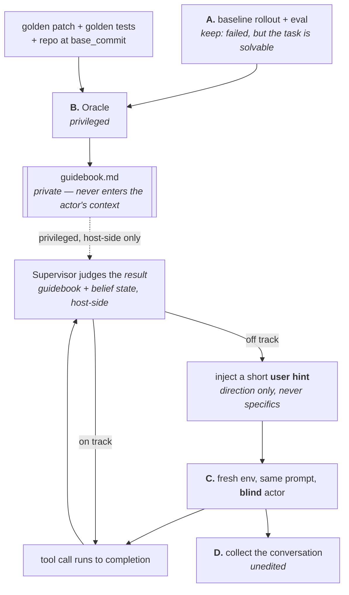

# Spec: Oracle-guided trace synthesis

> **Status: Draft (2026-09-01) · nothing implemented.** No code exists for any
> phase below; the invariants in [§12](#12-invariants-intended-none-enforced-today)
> are therefore **intended, not enforced** — each names the test that must land
> with the task that builds it. The mechanism decisions in
> [§5](#5-the-mechanism-decisions) were taken by the owner on 2026-08-31 and
> 2026-09-01 and are the design of record; earlier framings (a `PreToolUse`
> deny-and-redirect gate, and a phase D that surgically removed the
> interventions) are superseded and do not appear here.
>
> **Scope:** a new component, parallel to the [horizontal
> foundation](../horizontal/) rather than inside it — it consumes the engine,
> harness and workflow layers but adds a product line of its own (training-data
> synthesis) rather than shared plumbing.

## Objective

Produce **SFT training traces** for a coding agent on tasks in the *hard but
not impossible* band — around `pass@10 ≈ 3/10` — in which **every assistant
token is supported by the context visible before it**.

That second clause is the whole point. A trace is only worth training on if the
reasoning in it could have been produced by a model that knew only what the
trace shows it knowing. A trace that reaches the right answer by a route the
model could not have derived is worse than no trace: it looks like a good
example, and what it teaches is confident guessing.

## 1. The problem

Two obvious ways to get traces on this difficulty band both fail, and they fail
differently:

- **Rejection sampling** — run rollouts, keep the ones that pass. At 3/10 you
  burn roughly three rollouts per kept trace, and the ones you keep are the
  *lucky* ones. They frequently stumble into the answer, so what the data
  teaches is stumbling.
- **Imitating a privileged expert** — let an agent see the golden patch and
  write the trace. The result contains reasoning no blind model could have
  produced: "the fix is in `foo/bar.py`", with no derivation. Training on it
  teaches the model to *assert* knowledge it does not have, which is the
  shortest known path to a confident hallucinator.

## 2. What this is

The third way is an old idea in a new medium: **privileged-expert distillation
with on-policy correction**.

- *Learning by Cheating* (Chen et al., 2019) — a privileged agent sees ground
  truth; a blind student imitates it.
- *DAgger* (Ross et al., 2011) — the student rolls out and the expert corrects
  at the states the **student** actually visits, which is what removes the
  distribution shift plain behaviour cloning suffers from.

What is new is the medium of the correction: it is delivered as **a natural
user turn inside the conversation**, and it must be honest — vague enough that
the model's own next reasoning is a real derivation rather than the execution
of an instruction.

## 3. The pipeline

Four phases. A and B are offline and privileged; C is the run that produces the
trace; D is collection.

### Phase A — baseline rollout and eval

Existing machinery ([`rollout_and_unit_test`](../horizontal/plans/task-22-late-binding-workflows.md)).
It produces a conversation, a patch and a verdict. We keep the instances where
the verdict is **failed** while the task is **known solvable** (the gold
self-test resolves). That pair — a real failure on a real solvable task — is
the raw material.

Measuring the `pass@10 ≈ 3/10` band properly costs ten rollouts per instance.
"One failed rollout plus a passing gold self-test" is the cheap proxy, at the
price of a fuzzier band; which of the two we use is [an open
question](#11-open-questions).

### Phase B — the Oracle

A fresh agent with **privileged access** to:

- the full conversation of the failed rollout — what went wrong, in detail,
- the golden patch and the golden test patch,
- the repository at `base_commit`.

It produces one artifact: a **guidebook** — a staged, step-by-step document
telling a *future, blind* agent how to solve this task. One entry per stage:

| Field | Content |
|---|---|
| `goal` | what this stage establishes |
| `actions` | which files to open, which searches to run, which commands |
| `expected observations` | what you should see if you are on the right track |
| `justification` | **how you could have known to do this** — grounded only in the problem statement and earlier stages |
| `exit criteria` | what tells you the stage is done |
| `edits` / `tests` | for the stages that change code |

Two rules on the guidebook:

1. **It never says it saw the answer.** It reads as a tutorial, not as a diff
   summary.
2. **Every step carries a derivable justification.** This is not cosmetic. The
   Supervisor in phase C can only produce an honest nudge toward a step if a
   derivable reason for that step exists. A guidebook that says "open
   `foo/bar.py`" with no reachable *why* leaves the Supervisor nothing to say
   except the answer.

The guidebook is **private**: it is intended never to enter the actor's context
or the training trace. Nothing enforces that yet — see
[§12](#12-invariants-intended-none-enforced-today) for the test that must land
with the code.

### Phase C — the guided rollout

A fresh sandbox, the same prompt, an actor with **no** privileged information —
an ordinary rollout, as far as the actor is concerned.

The steering runs **after each tool call completes**. The tool executes
normally; the hook hands the call and its result to a host-side **Supervisor**
model together with the guidebook and the **belief state** — a running summary
of what an honest, blind agent would know from the observations so far. The
Supervisor then takes one of two branches:

- **On track** — do nothing; update the belief state.
- **Off track or looping** — inject a short **user hint**: the sort of thing a
  person watching over the agent's shoulder would say ("I don't think that's
  the right direction — have you considered how this interacts with X?"),
  giving **a direction and never a specific**.

The belief state lives **host-side, outside the sandbox**. If the actor could
read a file written with oracle knowledge, the construction collapses — which
is why that, too, is one of the
[invariants](#12-invariants-intended-none-enforced-today) a test has to pin.

### Phase D — collection

The conversation of the phase-C run **is** the training trace. **Nothing is
removed and nothing is synthesized** — see
[§6](#6-the-trace-is-the-conversation-unedited). D converts the harness's
`stream-json` into the typed
[`Conversation`](../horizontal/plans/task-06a-conversation-protocol.md) and
persists it with the run's records.

D is not quite nothing, though. Depending on how the head open question in
[§11](#11-open-questions) resolves, it may carry **one small, well-defined
step: materializing each hint as the user turn it semantically is**, from the
host-side hint log. That is an *insertion* of something the actor really
received — not the deletion of turns and not the synthesis of reasoning that
the superseded framing required, and it stays far simpler than either.

## 4. Why judging after the fact, and not before

The steering point is *after* the tool result, not before the tool call, and
the three reasons are structural rather than convenient:

1. **Judging after the observation is a far easier problem than predicting
   before it.** A pre-execution gate must answer "will this action turn out to
   be bad?" blind. A post-hoc judge answers "did that actually move us
   forward?" with the evidence in hand — fewer false interventions, and the
   ones it makes are better grounded.
2. **No fabricated tool failures.** A denial writes a `tool_result` with
   `is_error: true` for a call that would have succeeded — a lie inside the
   trace, which something downstream then has to remove.
3. **A user turn is a natural conversational shape.** People really do
   interrupt an agent with "I think you're going the wrong way". The
   conversation stays well-formed with no repair at all.

## 5. The mechanism decisions

Owner-decided (2026-08-31 / 2026-09-01). These are the design of record.

| Decision | Rationale |
|---|---|
| **Steer from a Claude Code hook** — not the proxy, not our own agent loop | The proxy ([task 08](../horizontal/plans/task-08-proxy-capture.md)) is already complex and folding steering into it couples the two badly. Our own agent loop abandons the point of this infrastructure, which is to hug the harness we actually want traces of. |
| **Never rewrite the tool call** | Measured: a rewritten call is *not* reflected back in the assistant turn, so the actor finishes the turn believing it did something it did not do, and every later step reasons from a false premise ([§10](#10-what-is-measured-about-hooks)). |
| **Never deny** | Let the call execute and take its result; see [§4](#4-why-judging-after-the-fact-and-not-before). |
| **Inject as a user hint** | The natural shape for "a person is course-correcting me", and the only shape in which the intervention is honestly *conditioning* rather than a fabricated observation. |
| **Direction only, never specifics** | The leakage / teaching dial; see [§8](#8-what-hint-specificity-now-trades). |
| **Not a system-reminder** | Claude Code already uses that channel heavily, so ours would be indistinguishable from machine noise — both to the actor at run time and to anyone reading the trace. |

## 6. The trace is the conversation, unedited

**The training trace is the phase-C conversation itself, with nothing removed.**
Not the conversation minus the hints; not a reconstruction assembled offline.
(The one thing [Phase D](#phase-d--collection) may *add* is the hint rendered
in the role it already holds — an insertion of text the actor really received,
which is the opposite of a reconstruction.)

The reason is a property of the training objective, not a convenience:

- SFT takes loss on **assistant tokens only**. A user turn is *conditioning*,
  never a target.
- So the model is never trained to **produce** a hint — only to **respond well**
  to one. There is no mechanism by which keeping the hint teaches the model to
  assert something it cannot know.

And the sharper half: **deleting the hint is what would create the leak.** Strip
the user turn and what remains is an assistant that pivots hard for no visible
reason — which is precisely the pathology in the
[Objective](#objective): a confident, unmotivated jump. Keeping the hint means
every assistant token is justified by its own visible context, by construction.

## 7. What that simplifies

Keeping the hints removes most of the machinery an earlier framing needed:

| Was going to be needed | Status under this design |
|---|---|
| A trace-surgery pass removing the intervention turns | **Gone** — there is nothing to remove. What may remain is an *insertion* (materializing a hint as a user turn, [Phase D](#phase-d--collection)), which is a much smaller thing |
| An inducibility invariant enforced by a checker | **Satisfied by construction** — nothing in the trace is unexplained |
| A blind judge used as a **leak detector** | **Not needed for that job** — it may still earn its keep as a plain quality filter |
| Synthesized "thinking" spliced in front of corrected actions | **Gone** — the model writes its own reasoning in response to the hint, and its `thinking` blocks survive capture ([§10](#10-what-is-measured-about-hooks)) |

This is the largest simplification the design has had, and it is what makes the
build tractable.

## 8. What hint specificity now trades

Not leakage any more — **how much the trace teaches**.

- **Too specific** ("the bug is in `config.py`") and the assistant is merely
  executing an instruction. The trace carries little skill, because the hard
  part was done by the hint.
- **Directional** and the assistant does the real derivation from evidence it
  actually holds. That derivation is the part worth learning.

So specificity trades steering power against teaching value, and it is the main
thing to tune. Prompt-level detail is deliberately deferred to the experiments.

## 9. Data mixture — to be validated, not solved

A diet of traces in which a helpful user always intervenes at exactly the right
moment plausibly teaches **dependence**: an agent that under-performs when
nobody is steering. This is a **data-mixture question and an open one** — the
obvious levers are mixing hinted with unhinted traces and keeping hints sparse,
but neither the mixture nor the sparsity has been measured, and nothing here
should be read as saying the problem is handled.

Worth recording alongside it: this trace shape corresponds to a **real usage
mode**. A person course-correcting a coding agent mid-task is one of the ways
these agents are actually used, so the data is plausibly in-distribution rather
than an artifact of the collection method.

## 10. What is measured about hooks

Claude Code `2.1.252`, measured on this machine 2026-08-31 / 2026-09-01 under
`claude -p --output-format stream-json --include-hook-events` with an isolated
`CLAUDE_CONFIG_DIR`. Documentation source:
[Hooks reference](https://code.claude.com/docs/en/hooks) (retrieved
2026-08-31/09-01). Where documentation and measurement disagreed, the
measurement is what is recorded.

| Fact | Status | Consequence here |
|---|---|---|
| A hook can fire on **every** tool call (`"matcher": ""`) | measured | Phase C is expressible |
| Hooks can be injected per-run with `--settings <file-or-json>` plus an isolated `CLAUDE_CONFIG_DIR`; the user's own `~/.claude` hooks did not fire | measured | Fits our sandbox wiring. `--restricted` also isolates but **forbids** `--dangerously-skip-permissions` |
| The actor's `thinking` blocks are present in full (text + signature) in both `stream-json` and the transcript | measured | The trace carries the model's own reasoning; nothing needs synthesizing |
| `PreToolUse` **can** replace `tool_input` via `hookSpecificOutput.updatedInput` — whole-object replace, not merge | measured | Available, and deliberately unused ([§5](#5-the-mechanism-decisions)) |
| After a rewrite, the assistant turn still shows the model's **original** `tool_use` while the result is the **rewritten** call's; nothing tells the actor | measured (`Edit`: model wrote `MODEL_WROTE`, hook wrote `HOOK_WROTE`, file on disk `HOOK_WROTE`, result said only "updated successfully") | The reason rewriting is banned: it desynchronizes the actor's own world model mid-run |
| `PostToolUse` observes the **rewritten** input, `PreToolUse` the original | measured | If we ever needed to log a triple, this asymmetry is where |
| A `PreToolUse` denial lands as a `tool_result` with `is_error: true`, content = `permissionDecisionReason` | measured | The shape we are avoiding |
| `PostToolUse` `decision: "block"` + `reason` lands in the transcript as a line of `type: "attachment"`, `attachment.type: "hook_blocking_error"` — **not** a message, and not a user turn | measured | **This is the head open question** ([§11](#11-open-questions)). In that run the model's own `thinking` named it "a post-tool hook message", weighed it against the user's actual instruction and declined to follow it. So the channel appears to affect **compliance**, not only trace shape — which strengthens rather than weakens the case for finding a genuine user-role channel. The task was trivial and already complete, so this is *weak* evidence about persuasion and strong evidence about shape |
| `additionalContext` is delivered wrapped in a system reminder | documented | Ruled out by [§5](#5-the-mechanism-decisions) |
| A built-in `type: "prompt"` / `"agent"` hook can only allow or deny | documented | The Supervisor must be our own `command` / `http` handler calling the API |
| Spawning `claude` inside a hook is blocked by the `CLAUDECODE=1` nesting guard, and there are recorded recursive cost-explosion incidents on `Stop` / `SessionEnd` | documented + measured (`CLAUDECODE=1` present in the hook environment) | Never nest the CLI; call the API |
| The hook subprocess does **not** inherit `CLAUDE_CODE_OAUTH_TOKEN` / `ANTHROPIC_API_KEY` | measured | The Supervisor needs its own credential passed in explicitly |
| `transcript_path` is on stdin but is written asynchronously and may lag; under `--no-session-persistence` the path is reported and the file does not exist | measured | Never treat it as an authoritative real-time prefix |
| `command` / `http` hook timeouts default to **600 s** and **fail open** — a timed-out hook's output is discarded and the run continues | documented | A silent data-corruption source; see [§11](#11-open-questions) |
| Matched hooks run **in parallel**, so a batch of parallel tool calls produces N concurrent hook invocations | documented | Argues for one decision per batch; see [§11](#11-open-questions) |

**Harness scope.** Hooks are a Claude Code mechanism. `codex` and `grok_build`
have no equivalent, so this design is `claude_code`-only — even though
`grok_build`'s headless output happens to share Claude Code's `stream-json`
schema ([task 29](../horizontal/plans/task-29-grok-harness.md)).

## 11. Open questions

**Head question — what shape can the hint actually take?** The design wants a
genuine **user-role turn** at a tool boundary, and no hook output is documented
to produce one. `PostToolUse` `decision: "block"` + `reason` has been measured
and is **not** it (it lands as an `attachment`, [§10](#10-what-is-measured-about-hooks)).
The remaining candidates are `updatedToolOutput` (deletable, but it puts our
words in the tool's mouth), `PostToolBatch`'s `decision` / `additionalContext`
(fires after a batch and before the next model request — arguably the natural
seam), and re-confirming what `additionalContext` looks like at this version.
**This is a measurement, not a discussion**, and it is the first thing the
build has to settle.

It has a second half, and it is the more consequential one: even for a shape
the actor *sees*, our typed `Conversation` conversion must **preserve** it. An
`attachment` line most likely converts to nothing — and a trace that silently
drops the hint is exactly the unmotivated-pivot trace that
[§6](#6-the-trace-is-the-conversation-unedited) calls worse than useless. If no
hook output survives conversion as a visible turn, the alternative is to log the
hint host-side and **materialize** it as a user turn during conversion.

**Leaning (orchestra's, pending the owner's sign-off — not a decision):
materializing is acceptable, and probably right.** The argument is that the
hint *is* user intent already; Claude Code merely happens to deliver it over an
attachment channel. Rendering it in the role it semantically holds is more
honest than preserving an implementation detail. What the training trace
asserts — "having received X, the assistant produced Y" — stays true, because
the actor really did receive that text. **The only fiction is the channel, not
the information.**

That has to be **declared, never hidden.** If we materialize, the spec's own
statement is that the live run and the training trace differ at the channel
layer, and both sides must be retained — the host-side hint log *and* the raw
transcript — so any trace can be traced back to what actually happened.

**The one fatal failure mode is a hint disappearing silently.** That produces
precisely the unmotivated-pivot trace this whole design exists to avoid, and it
would do so while looking fine. So, as a hard constraint on whatever the
resolution turns out to be: **a hint lost in conversion must be detectable, and
conversion must fail rather than silently emit a hint-less trace.**

The rest, in no particular order:

- **Which events do we hook?** `PostToolUse` fires only after a tool
  *succeeds*; a failure goes to `PostToolUseFailure`, and a permission or
  schema failure triggers neither. "The agent is spinning after an error" is
  one of the moments a hint is most valuable, so a `PostToolUse`-only design
  has a hole in it. `PostToolUseFailure` and `PostToolBatch` are measured
  **together with** the user-turn experiment above, not after it — they change
  what that experiment is even asking.
- **One hint per batch, or one per call?** Parallel tool calls fan out to
  parallel hooks; several hints arriving at once is both expensive and
  incoherent. `PostToolBatch` fires after a batch and before the next model
  request, which is the natural seam if it can carry the hint.
- **What happens when the Supervisor times out?** The default is fail-open —
  the hint is silently dropped and the run continues. Silently is the one
  behaviour that quietly changes the dataset, so the policy must be explicit
  and the occurrence must be recorded per attempt.
- **Selection.** Measure the `pass@10` band (ten rollouts per instance) or use
  the cheap "failed once, gold self-test passes" proxy?
- **Guidebook reuse.** One guidebook per instance, reused across attempts, or
  regenerated per attempt from the newest failure?
- **Triage.** Can a cheap model answer "on track?" and escalate to an expensive
  one only on suspicion (a repeated file, an error loop, no progress)?
- **Termination.** What ends a guided rollout that is still failing — a hint
  budget, a fallback to a more directive Supervisor, or discard?
- **Quality filtering.** A blind judge is no longer needed as a leak detector
  ([§7](#7-what-that-simplifies)); is it worth building as a plain trace-quality
  score?
- **Cost.** One Supervisor call per tool call, on a task that runs 50–200 of
  them, on top of a baseline rollout, an oracle analysis and a guided rollout
  that can still fail and cost all of that for nothing. Whether the yield
  justifies it is the question [the batch measurement](plans/README.md) exists
  to answer.

## 12. Invariants (intended; none enforced today)

Per `AGENTS.md`, an *always / never* claim needs a named test or it must be
softened. Nothing below is implemented, so every row is **intended** and names
the test that must land in the same change as the code it constrains.

| Intended invariant | Test that must pin it |
|---|---|
| The guidebook never enters the actor's context or the training trace | a test asserting the guidebook path is absent from phase C's mounts and from the serialized `Conversation` |
| The belief state is host-side only — never written into the sandbox | a test asserting no phase-C mount or write target resolves to the belief-state file |
| Every phase B / C record carries the oracle-guided policy stamp | a test asserting the stamp is present on the record and that aggregation across differing stamps still errors |
| A dropped or timed-out Supervisor decision is recorded, never silently ignored | a test asserting the run record shows the drop |
| A hint lost in conversion is detectable — conversion fails rather than emitting a hint-less trace | a test feeding a run whose hint the converter cannot represent and asserting conversion errors |

## 13. Where this plugs into swe-lab

The workflow layer ([ADR-0007](../decisions/ADR-0007-task-and-workflow-layer.md))
already has the right shape — statically declared entries with edges resolved
from the store — so this is a workflow, not a new subsystem.

| Phase | Reuses | New |
|---|---|---|
| A | `rollout_and_unit_test`, unchanged | — |
| B | the `Task` layer | a task that mounts the golden patch and tests, with the git-history purge **off**; declared output `guidebook.md` |
| C | the rollout composition | hook settings injected into the sandbox (`--settings` + `CLAUDE_CONFIG_DIR`); a host-side Supervisor; declared intervention records |
| D | the `Conversation` converter + `Store` | — |
| all | `register_workflow(...)` | the A→B→C→D edges |

## 14. Integrity red lines

**Phases B and C are deliberately contaminated.** B mounts the golden patch and
tests; the git-history purge
([task 25](../horizontal/plans/task-25-git-history-purge.md),
[ADR-0010](../decisions/ADR-0010-benchmark-integrity.md) §3b) must be **off**
for it. Two consequences, and neither is negotiable:

1. **These runs are never pooled with benchmark numbers.** ADR-0010 §5's
   **policy stamp** is the mechanism: the record carries the policy that
   produced it, and aggregation across differing stamps is already defined as
   an error rather than a warning. Oracle-guided runs carry a stamp that says
   so.
2. **The result verifier ([task 26](../horizontal/plans/task-26-result-verifier.md))
   will flag these runs as contaminated, and that is correct behaviour.** We
   declare the contamination; we do not suppress the detector. A change that
   makes the verifier quiet about oracle-guided runs is a bug in this design,
   not a fix.

## 15. Success criteria

1. A hint reaches the actor as a turn that is **visible in the training trace**
   and reads as a person speaking — or, if no mechanism can do that, an
   explicit owner decision on the alternative
   ([§11](#11-open-questions)).
2. On at least one instance, a supervisor holding a good guidebook steers a
   blind actor from a known failure to a passing verdict. Until this is shown,
   nothing else in the pipeline is worth building.
3. Sampled traces read as honest: each assistant turn is explicable from the
   turns before it, judged by a human reader.
4. Every oracle-guided record carries the policy stamp, and no aggregation
   pools it with benchmark runs.
5. A measured cost per kept trace, and a yield, good enough to argue the
   pipeline beats rejection sampling on the same instances.

## 16. Out of scope

- **Harnesses other than `claude_code`.** No hook equivalent exists for `codex`
  or `grok_build` ([§10](#10-what-is-measured-about-hooks)).
- **Rewriting the actor's tool calls or its assistant turns.** Banned by
  [§5](#5-the-mechanism-decisions); a proxy-based design that could rewrite the
  assistant turn is a different design, not a later phase of this one.
- **Training itself.** This component produces traces; running SFT on them is
  somebody else's pipeline.
- **Deciding the data mixture.** [§9](#9-data-mixture--to-be-validated-not-solved)
  states the risk; measuring it is downstream of having traces at all.
